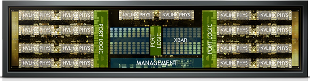
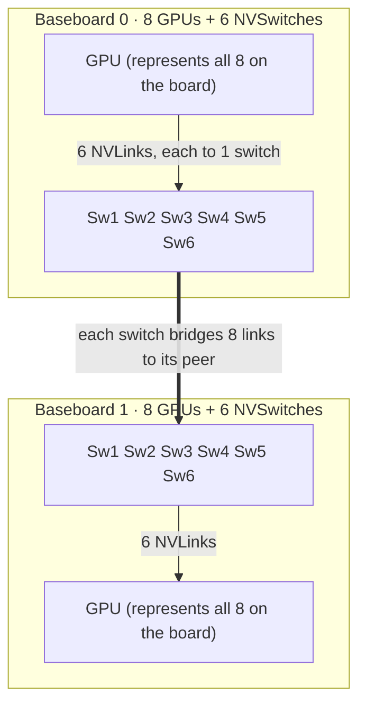
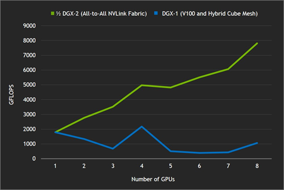
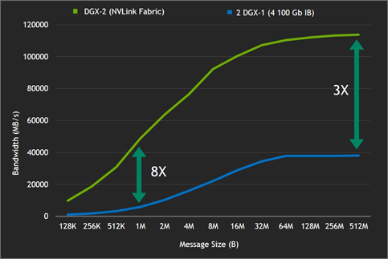
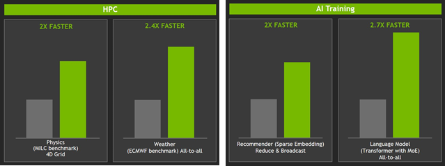

# How Are NVIDIA GPUs Interconnected? Topology Evolution from NVSwitch to NVL72

> When we say "train a large model on 8 / 16 / 72 GPUs," **how exactly are those GPUs wired together**? Why can't we just use PCIe? Why did NVIDIA build a dedicated switch chip called NVSwitch? From the 2018 DGX-2 to the 2026 Vera Rubin, the interconnect has gone through several step-changes, and behind every change is a very clear engineering motivation and trade-off. This note connects the dots.

## Why Isn't PCIe Enough?

Multi-GPU training can scale near-linearly only if the GPUs can **exchange data fast**. But the traditional PCIe bus has two fatal weaknesses:

- **Bandwidth is too low**: PCIe Gen5 is about 64 GB/s per direction, while even early NVLink was ~10× faster; by the Blackwell generation, NVLink 5 is **14×** of PCIe Gen5.
- **The topology is a shared tree**: multiple cards hang off the same group of PCIe switches / root complex, so communication has to detour through the CPU or an upstream switch — easily congested in "all-to-all" scenarios.

The figure below shows the path of two GPUs communicating over PCIe — data must pass through each GPU's PCIe I/O and then be relayed by the CPU, a shared hub. Both the CPU and the PCIe link become bottlenecks:

So in the Pascal era NVIDIA introduced **NVLink** — a private high-speed point-to-point link between GPUs, turning the data path from "detour through the CPU" into "direct card-to-card":

But NVLink alone isn't enough, because point-to-point direct connections have a ceiling — covered below.

## The Two Protagonists: NVLink and NVSwitch

To understand NVIDIA's interconnect, first separate two things:

| Name | What it is | Role |
| --- | --- | --- |
| **NVLink** | A set of high-speed serial links (SerDes) on the GPU | Provides the GPU↔GPU physical channel |
| **NVSwitch** | A standalone switch chip | Aggregates and switches many NVLinks for full interconnect |

An analogy: NVLink is the "network cable" each GPU sticks out, and NVSwitch is the "switch" you plug those cables into.

### Why Won't NVLink Direct Connections Alone Work?

The first-generation multi-GPU design (DGX-1) used NVLink to directly wire 8 GPUs into a "hybrid cube mesh." The problem: each GPU has a limited number of NVLinks and can't establish a direct connection to every other GPU. So in an **all-to-all** scenario (where every card must talk to every other card), some GPU pairs have no direct link and must fall back to the much slower PCIe path — a bottleneck.

The figure below captures this dilemma vividly: when 16 GPUs all want to talk to each other, the "?" in the middle is the missing layer — a switching layer that lets any two cards reach each other at full speed.

To let "any two GPUs reach each other at full speed" and to scale beyond 8 cards, you need a **switching layer**. That's why NVSwitch was born.

## What Is NVSwitch: A Non-Blocking 18×18 Crossbar

Take the first-generation NVSwitch (Volta / DGX-2, 2018) as an example. It's a standalone 2-billion-transistor chip, physically made of a ring of NVLink PHYs, the corresponding Port Logic, and a central XBAR crossbar:

Its core specs:

| Spec | Value |
| --- | --- |
| Ports | 18 NVLink ports |
| Internal structure | 18×18 fully-connected crossbar |
| Per-port bandwidth | 50 GB/s bidirectional (25 GB/s × 2 directions) |
| Per-chip aggregate bandwidth | 900 GB/s |
| Transistors | 2 billion |

Below is its functional block diagram: each of the 18 NVLink ports has its own Port Logic (handling routing, classification, error checking, and statistics), with a central 18×18 XBAR, plus Management and PCIe I/O for the control plane:

::: tip Key concept: non-blocking
The crossbar is "non-blocking" — any ingress port can hit any egress port at full speed, and many port pairs can communicate at full speed simultaneously without contention. This is the physical foundation of "pretending to be one big GPU."
:::

For data integrity, NVSwitch provides layered protection, which is critical for production:

- **NVLink link layer**: CRC error detection + automatic retransmission.
- **Inside NVSwitch**: data paths, routing tables, and state structures are ECC-protected, plus last-hop address checks and buffer over/underflow checks.
- **Security isolation**: routing tables are indexed and managed centrally by the **Fabric Manager**, restricting each application to its own address range — essentially multi-tenant isolation at the switch fabric layer.

## Topology: Using DGX-2 (16 GPUs) as an Example

DGX-2 is the best sample for understanding this topology. Its physical structure:

- **2 GPU baseboards**, each carrying **8 V100s + 6 NVSwitches**.
- The whole machine: **16 GPUs + 12 NVSwitches**.

The way they connect is the essence of the whole design:

Breaking down the key points:

1. **Each V100 has 6 NVLinks**, and these 6 connect **separately** to the 6 NVSwitches on the same baseboard — each switch takes 1 link from each GPU.
2. **Each NVSwitch's 18 ports** are allocated like this: 8 connect to the 8 GPUs on this board, 8 connect to the corresponding NVSwitch on the other baseboard, and **2 are reserved**.
3. The same-numbered Sw in the top and bottom rows (e.g., the two Sw1) are **two independent physical chips** (one on each board); they pair up and interconnect with 8 NVLinks.

::: tip Key distinction: hops ≠ number of chips
"6 NVLinks aggregate to 300 GB/s, single-hop" refers to **hops**, not using only one chip. When GPU A sends to same-board GPU B, the traffic is **split into 6 parts that travel in parallel across 6 switches** (50 GB/s each, 300 GB/s total), and each part **traverses only 1 switch** (1 hop). In short: "6 chips used at once, but each packet passes through only one of them."
:::

This yields two bandwidth conclusions:

- **Same-board GPU communication**: single hop, full 300 GB/s.
- **Cross-board GPU communication**: two hops (local switch → peer switch), still full 300 GB/s.
- **Bisection bandwidth between boards**: 6 switches × 8 cross-board links = 48 links, 48 × 25 GB/s (per direction) × 2 = **2.4 TB/s**.

The direct payoff of this full-interconnect topology is bandwidth that scales near-linearly with GPU count. The figure below is a measured all-reduce on DGX-2: from 1 to 16 GPUs, aggregate bandwidth climbs almost as a straight line — exactly what "16 GPUs used as one" looks like in performance:

## Why Interconnect This Way?

### The Numbers "6" and "12" Aren't Arbitrary

The whole layout is forced by two hard constraints:

$$\text{switches per board} = \frac{\text{NVLinks per GPU}}{1} = 6, \qquad \text{ports used per switch} = \text{GPUs per board} = 8$$

- Each GPU emits **6** NVLinks → you need **6** switches to receive them separately (one link each).
- Each switch must catch 1 link from each of the 8 GPUs on the board → uses **8 ports**.
- Total intra-board NVLinks 8 × 6 = 48 = 6 switches × 8 ports — the books balance.

::: tip Core insight
**"6" = the GPU's NVLink count, "18" = the switch's port ceiling.** The whole topology is the geometric consequence of these two numbers, not a free design choice.
:::

### Why "Spread Across Many Chips" Instead of "One Big Chip"

- **Physical port ceiling**: one chip has only 18 ports, limited by the number of SerDes that fit on the die edge, package pins, and power. Connecting 16 cards × 6 = 96 links with a single chip is impossible.
- **Spreading bandwidth enables non-blocking**: a GPU's 6 links spread across 6 switches means traffic between any two cards naturally takes 6 parallel paths and won't pile up into a bottleneck on a single chip.
- **Fault tolerance**: a single switch failure is "degradation," not "total outage."

The advantage of full interconnect (all-to-all NVLink fabric) over the previous generation's direct hybrid cube mesh shows up immediately on bandwidth-sensitive workloads. The figure below compares half a DGX-2 (green, full interconnect) against DGX-1 (blue, hybrid cube mesh) on cuFFT scaling — the direct-connect scheme drops off sharply after 4 cards because it "can't assemble direct links," while full interconnect scales steadily and linearly:

### Why Obsess Over "Cross-Board Bandwidth"

DGX-2's core selling point is "**use 16 GPUs as one GPU, with the topology transparent to the programmer**." This abstraction holds only if **bandwidth is equally full no matter which two cards you pick**. If cross-board is slower, it becomes a NUMA-style "non-uniform bandwidth," forcing the programmer to care about "are these two cards on the same board" — and the abstraction breaks. Moreover, collective communication (e.g., all-reduce) is gated by the **slowest link**, so the cross-board path, which is most likely to be the weak link, must be made full.

## What's the Relationship Between NVLink and InfiniBand?

Many people confuse the two, but they're actually **two complementary network layers**:

| | NVLink / NVSwitch | InfiniBand / RoCE Ethernet |
| --- | --- | --- |
| Role | **Scale-up** (vertical, within node/rack) | **Scale-out** (horizontal, between nodes) |
| Bandwidth scale | TB/s | tens of GB/s (an order of magnitude lower or more) |
| Protocol | NVIDIA proprietary | Open standard |
| Purpose | Tightly couple a handful of GPUs into "one big GPU" | Stitch many nodes into a large cluster |

The figure below makes the gap vivid: for the same all-to-all, DGX-2's internal NVLink fabric (green) is about **8×** faster on small messages and about **3×** faster on large messages than two DGX-1s over 4×100Gb InfiniBand (blue):

In one sentence: **NVLink handles inside the box, InfiniBand handles between boxes.** A large-model training job typically uses NVLink within a node for bandwidth-sensitive Tensor Parallelism, and IB between nodes for Data / Pipeline Parallelism — the two stacked together.

## Interconnect Evolution Across Generations: From 16 GPUs to 72

This is the focus of the article. Put five architectures side by side and the evolution is clear:

| Generation | GPU | NVLink | Links per GPU | Per-link BW (bidir) | Per-GPU total BW | NVSwitch | NVLink domain size |
| --- | --- | --- | --- | --- | --- | --- | --- |
| Volta (2018) | V100 | 2.0 | 6 | 50 GB/s | 300 GB/s | gen1, 18 ports | 16 GPUs / node |
| Ampere (2020) | A100 | 3.0 | 12 | 50 GB/s | 600 GB/s | gen2 | 8 GPUs / node |
| Hopper (2022) | H100 | 4.0 | 18 | 50 GB/s | 900 GB/s | gen3, 64 ports | 8 GPUs / node |
| Blackwell (2024–25) | B200 / GB200 | 5.0 | 18 | 100 GB/s | 1.8 TB/s | gen4, 72 ports | **72 GPUs / rack** |
| Rubin (2026) | Rubin | 6.0 | ~18 | ~200 GB/s | ~3.6 TB/s | switch tray | 72 packages / rack (NVL144) |

Three distinct lines of evolution emerge from this table.

### Evolution 1: Per-GPU Bandwidth Nearly Doubles Each Generation, but the Method Changes Midway

From V100 to H100 (300 → 600 → 900 GB/s), the gains came entirely from **adding links** (6 → 12 → 18), while per-link bandwidth stayed at 50 GB/s. At **18 the number topped out** (limited by die-edge SerDes and power), so afterward Blackwell and Rubin stopped adding links and instead **doubled per-link bandwidth**:

- NVLink 5 (Blackwell) doubled per-lane rate to 200 Gbps, giving 100 GB/s bidirectional per port, 18 ports = 1.8 TB/s.
- NVLink 6 (Rubin) doubles again to ~3.6 TB/s per GPU.

::: tip Engineering logic
Fix 18 ports, double per-link bandwidth each generation — this way the switch's 18×18 port architecture can be reused across generations, the ecosystem stays stable, and the cost shifts onto demands on SerDes modulation (PAM4, higher Gbps/lane) and packaging.
:::

### Evolution 2: Switches Get Bigger, but Fewer Are Needed

In the DGX-2 era, each board needed 6 switches for 8 cards; by Hopper, each HGX H100 uses just **4** third-generation NVSwitches to provide 3.6 TB/s bidirectional bandwidth for 8 cards, because per-switch port count rose sharply (64~72 ports from gen3 onward). With a bigger denominator, fewer chips are needed.

The third-generation NVSwitch also introduced **SHARP (in-network computing)**: the switch can aggregate data from multiple GPUs directly in the network, without round-tripping to each GPU every time. This means **the summation in all-reduce can be offloaded into the switch**, a real speedup for bandwidth-intensive collectives — a qualitative leap from Volta's "dumb switching" to today's "smart fabric."

### Evolution 3: The Biggest Paradigm Shift — NVSwitch Moves Out of the Server, into the Rack

This is the change most relevant to "topology."

- **Volta~Hopper**: NVSwitch was soldered onto the GPU baseboard, and the NVLink domain was trapped within one node (≤16 GPUs).
- **Blackwell**: NVSwitch became a standalone **switch tray** mounted in the rack. NVL72 uses 9 switch trays (each with 2 ASICs, 18 total) and 5,184 passive copper cables to make **72 GPUs** fully interconnected within the rack, with 130 TB/s aggregate bandwidth — the whole rack acts like one logical big GPU, and can extend further to 576 GPUs in the fabric.

The figure below is a full GB200 NVL72 rack: the vertical "spine" in the middle is the NVLink switch tray + copper-cable backplane, fully interconnecting the 72 GPUs across the 18 compute trays stacked above and below:

::: tip Core insight
The idea of "use N GPUs as one" never changed; only **N** did: from DGX-2's 16 (one node) to NVL72's 72 (one rack). The larger the NVLink domain, the larger the TP / EP scale you can fit into the "full-speed interconnect zone," and communication that used to have to cross IB can stay within NVLink.
:::

### On Rubin (the Latest Generation)

Rubin is still rolling out; a few details worth noting: in naming, NVIDIA switched to a new "count by die" convention — NVL144 and NVL72 are actually both 72 GPU packages, and NVL144 is named by die count; Rubin's switch tray uses 4 NVLink ASICs (NVL72 uses 2), doubling bandwidth by doubling ASICs; and for backward compatibility with Blackwell's Oberon rack, it **reuses that same 5,184-cable passive copper backplane**. Sources still differ on whether to call it NVLink 6 or 7, so treat the related numbers as "near-final but possibly subject to minor revision."

## What Are These Changes For? And What Did They Cost (Trade-offs)?

Every interconnect upgrade is not a free lunch. Let's lay out the trade-offs:

| Change | Purpose | Cost / Trade-off |
| --- | --- | --- |
| NVLink replaces PCIe | Higher bandwidth + point-to-point topology | Proprietary protocol, vendor lock-in; only on purpose-built servers (DGX/HGX) |
| Introduce NVSwitch | Break the point-to-point ceiling, enable full interconnect | Extra chip cost, power, board-level complexity |
| Split into many switches | Non-blocking + fault tolerance + bypass port ceiling | Complex routing, power, cooling; board-area footprint |
| Double per-link bandwidth each gen | Keep raising bandwidth under a fixed 18 ports | SerDes power skyrockets, liquid cooling becomes mandatory; extreme demands on packaging and signal integrity |
| Move switches into the rack (NVL72) | Expand NVLink domain from 16 to 72+ | Rack-scale liquid cooling, ~120kW power, millions of dollars per rack; larger blast radius |
| Stick with passive copper backplane | Low power, low cost, high reliability, zero optical modules | Distance-limited (copper only works at rack scale), capping the physical radius of a single NVLink domain |

A few trade-offs worth expanding:

::: tip Copper vs Optics
NVL72/NVL144 stick with **passive copper** rather than optical interconnect — copper draws no power, is cheap and reliable, but has short reach. This locks the physical ceiling of the NVLink domain at the scale of "one rack." To scale further (across racks), you must return to the InfiniBand / optical scale-out path. **The physical limit of copper, in a sense, defines how big a "logical GPU" can be.**
:::

::: tip The fundamental scale-up vs scale-out trade-off
NVLink (scale-up) has high bandwidth but is expensive with a limited domain; IB / Ethernet (scale-out) is cheap and infinitely scalable but an order of magnitude slower. Cramming more GPUs into the NVLink domain reduces slow cross-IB communication, but every doubling of the NVLink domain amplifies cost, power, and blast radius. That's why not all GPUs are NVLink-connected — **only the most communication-sensitive parallelism (TP / EP) is worth occupying expensive NVLink bandwidth.**
:::

## Practical Engineering Considerations

::: warning How to map parallelism choices to topology
- **Tensor Parallelism**: multiple all-reduces per layer, on the critical path, extremely sensitive to bandwidth and latency → must stay within the NVLink domain (TP degree usually ≤ GPUs per node/rack).
- **Pipeline Parallelism**: only passes a small amount of activations at stage boundaries, insensitive to bandwidth → suitable across IB.
- **Data Parallelism**: one gradient all-reduce per step, overhead can be hidden by compute → place outermost, tolerant of slower cross-node links.
- **Expert Parallelism (MoE)**: dispatch + combine are two all-to-alls, most bandwidth-hungry → keep within the NVLink domain as much as possible.
:::

Keep this mapping in mind, and looking back at NVIDIA's topology evolution, you'll see that **every interconnect upgrade is essentially in service of "cramming more sensitive parallelism into a larger full-speed domain."** This also pays off on real workloads — the figure below shows DGX-2's full-interconnect fabric speedup over the previous generation on HPC and AI training, with the most all-to-all-hungry MoE language model gaining the most (2.7×):

## Summary

| Question | Answer |
| --- | --- |
| How are GPUs interconnected? | NVLink links on the GPU + standalone NVSwitch chips |
| What does the topology look like? | Each GPU's N NVLinks spread across N switches; the switch internals are a non-blocking crossbar |
| Why not PCIe? | An order of magnitude lower bandwidth, and the shared tree topology congests under all-to-all |
| Why obsess over cross-board/cross-rack bandwidth? | For the "N GPUs as one" abstraction to hold, any two cards must have uniform, full bandwidth |
| How did it evolve across generations? | First add links (6→12→18), then double per-link bandwidth (50→100→200 GB/s); switches get bigger and fewer; finally move out of the node into the rack |
| What's the purpose of the changes? | Expand the NVLink full-speed domain from 16 to 72+ GPUs, so more sensitive parallelism (TP/EP) can stay in the scale-up domain |
| Main trade-offs? | Bandwidth ↔ power/cooling/cost; copper is reliable ↔ distance-limited; scale-up is fast but small and expensive ↔ scale-out is cheap but slow |

The most fascinating thing about the NVLink / NVSwitch line is this: **the constraints barely changed** (GPU link count, switch port count, copper's physical radius — these hard ceilings have always driven the design), yet through "add links → double per-link bandwidth," "make switches bigger and fewer," and "move switches into the rack," NVIDIA pushed the boundary of "use as one GPU" from 16 to 72 and beyond. A follow-up post could work through: on this NVL72 setup (a 72-GPU NVLink domain + cross-rack IB), how should a concrete MoE model map TP / EP / PP?

---

> **Image sources**: All figures in this article are from NVIDIA's official technical blogs and white papers, including [NVSwitch Accelerates NVIDIA DGX-2](https://developer.nvidia.com/blog/nvswitch-accelerates-nvidia-dgx2/), [NVSwitch Technical Overview](https://images.nvidia.com/content/pdf/nvswitch-technical-overview.pdf), and [GB200 NVL72](https://developer.nvidia.com/blog/nvidia-gb200-nvl72-delivers-trillion-parameter-llm-training-and-real-time-inference/). Copyright belongs to NVIDIA; reproduced here for technical study only.
