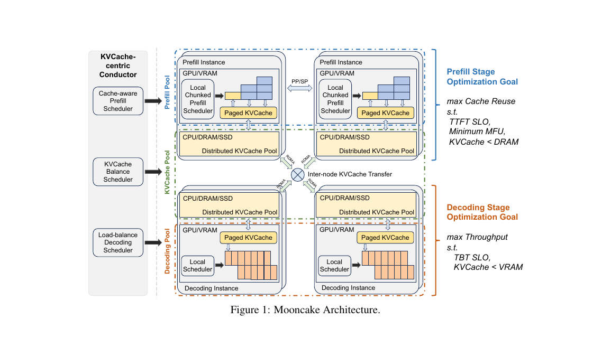
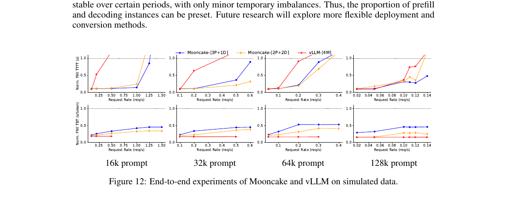

# Prefill/Decode Disaggregation and Mooncake: The Next Step for LLM Inference

> In Q1 2026, the three major inference engines — vLLM, SGLang, and TensorRT-LLM — all integrated the **Mooncake Transfer Engine** within two months of each other, pushing Prefill/Decode disaggregation (P/D disaggregation) from academic papers into production systems. This article walks through the motivation, the transfer mechanism, and the design differences between the three engines.

## Why split Prefill and Decode?

In an earlier article I wrote that the two phases of LLM inference have completely different bottlenecks — [Prefill is compute-bound, Decode is memory-bound](./nvidia-vera-rubin-lpx.md). A single GPU running both phases can only ever optimize for one of them.

| Phase | Input | Bottleneck | Ideal Hardware |
|---|---|---|---|
| Prefill | The full prompt (hundreds to thousands of tokens) | Matrix compute (FLOPS) | High compute, can saturate Tensor Cores |
| Decode | 1 token from the previous step | HBM bandwidth (Bytes/s) | High HBM bandwidth, low latency |

**The cost of colocation:**

1. During Decode, large numbers of Tensor Cores sit idle waiting for data to arrive from HBM
2. The bulk compute of Prefill blocks in-flight Decode requests, causing TBT (Time Between Tokens) jitter
3. To meet latency SLOs, batch size has to be kept low, and overall GPU utilization typically sits below 30%

**The disaggregation idea:**

- **Prefill node pool**: dedicated to prefill. Large batches, high compute utilization; insensitive to HBM bandwidth, can even reuse older-generation GPUs
- **Decode node pool**: dedicated to token-by-token generation. Needs the latest high-bandwidth HBM, but compute is secondary
- What flows between the two pools is the **KV Cache** (the attention intermediate state of the prompt)

::: info A concrete example
If your service averages 1K tokens of prompt and 200 tokens of output, then 99% of the token positions are actually in the Decode phase. Putting Decode on bandwidth-optimal nodes while letting older H100 clusters handle Prefill can cut total cost of ownership (TCO) by 30–50%.
:::

## The cost of splitting: the KV Cache has to cross nodes

Disaggregation looks great on paper, but there's a hard bone to chew on: **the KV Cache produced by the Prefill node has to be delivered in full to the Decode node**.

KV Cache size is not a small number. Take a 70B model with a 4096-token prompt in FP16:

$$
\text{KV Cache size} = 2 \times L \times H \times D \times T \times \text{bytes}
$$

where $L$ is the number of layers (80), $H$ is the number of heads (64), $D$ is the head dimension (128), $T$ is the token count (4096), and bytes=2 (FP16):

$$
2 \times 80 \times 64 \times 128 \times 4096 \times 2 \approx 10.7 \text{ GB}
$$

In other words, **a single request's KV Cache can reach the 10GB range**. Over plain TCP on a 100Gbps network, that takes 0.8 seconds to transfer — equivalent to making the user wait through an entire Decode phase before generation even starts.

Three key challenges:

1. **Latency**: the wait from Prefill completion to Decode start counts directly against TTFT (Time To First Token)
2. **Bandwidth**: with many concurrent requests, aggregate transfer bandwidth can saturate the network
3. **Zero-copy**: the KV Cache lives in GPU memory; routing through CPU means four hops — GPU→CPU→NIC→CPU→GPU

## Mooncake Transfer Engine: built for KV transfer

Mooncake is jointly open-sourced by Moonshot AI (the company behind Kimi) and Tsinghua's KVCache.ai team. The core idea is a **KV Cache-Centric Disaggregated Architecture** — the entire inference system is designed around the flow of the KV cache.

### Core components

| Component | Role | Analogy |
|---|---|---|
| **Transfer Engine** | Zero-copy cross-node KV transfer, supporting RDMA/EFA/Ascend | The OS DMA controller |
| **Mooncake Store** | Tiered KV cache: GPU VRAM → host RAM → remote storage | Multi-level cache (L1/L2/L3) |
| **P2P Store** | Distributed checkpoint engine for fast large-model sync | Git for code |



### Three key designs in the Transfer Engine

**1. RDMA zero-copy — note: what's skipped is the CPU, not the network**

There's a common misconception here: RDMA does not magically bypass the network. **The data still has to travel the physical link from one NIC to another.** What it actually skips is CPU involvement and host memory copies on both ends.

On the traditional TCP path, a single cross-node GPU→GPU transfer goes through:

```
src GPU VRAM → src host RAM (PCIe copy + CPU involvement)
             → NIC send buffer (another CPU copy)
             → network (physical link, unavoidable)
             → dst NIC receive buffer
             → dst host RAM (CPU copy)
             → dst GPU VRAM (PCIe copy)
Total: 4 memory copies + interrupt handling on both CPUs
```

On the GPUDirect RDMA path, both NICs use PCIe to DMA **directly to and from GPU VRAM**, with CPU, kernel, and host RAM entirely out of the data path:

```
src GPU VRAM  ──(NIC DMA)──→  network  ──(NIC DMA)──→  dst GPU VRAM
Total: 0 host memory copies, CPU not on the data path
```

So "zero-copy" means **zero host memory copies / zero CPU involvement**. Network bandwidth is still the hard ceiling: 100/200/400 Gbps InfiniBand sets the floor on transfer time. The RDMA win is bringing latency down from "milliseconds + CPU jitter" to "microseconds + deterministic latency," and freeing the CPU entirely for scheduling logic.


**2. Multi-backend support**

To fit the variety of datacenter hardware, the Transfer Engine abstracts a unified API supporting:

- **RDMA (InfiniBand / RoCE)** — standard NVIDIA clusters
- **EFA (Elastic Fabric Adapter)** — AWS's custom NIC
- **Ascend** — Huawei Ascend NPU clusters

**3. Block-level transfer**

The KV Cache is transferred at the same **Block** granularity as PagedAttention (default 16 tokens/block). This brings two benefits:

- Once Prefill finishes a block, it can start pushing it to the Decode node — **transfer and compute become pipelined**
- When a request is preempted or migrated, the block granularity keeps recovery cost minimal

## Mooncake Store: tiered KV caching

On top of the bare Transfer Engine, Mooncake provides a tiered caching system called **Mooncake Store**. The core idea: **KV Cache doesn't have to be recomputed every time.**

In many real workloads, prompts have reuse patterns:

- Multi-turn conversations share an identical system prompt
- RAG systems frequently re-encounter the same retrieved documents
- Few-shot examples are shared across a batch of requests

Mooncake Store hosts KV across three tiers:

| Tier | Medium | Latency | Capacity |
|---|---|---|---|
| Device Tier | GPU HBM | ns ~ μs | 10s GB |
| Host Tier | Host DRAM | μs | 100s GB |
| Remote Tier | Distributed storage (SSD/NVMe over RDMA) | ms | TB ~ PB |

A hit at the Host tier means skipping Prefill entirely and going straight to Decode; a hit at the Remote tier still requires loading the KV back into the GPU, but it's still far faster than recomputing.

## Integration status across the three engines

From late 2025 through early 2026, the three major engines all completed Mooncake integration almost simultaneously, but their design philosophies differ noticeably.

### vLLM: the KV Connector abstraction

vLLM v1 introduced a **KV Connector** plugin interface, and Mooncake is one implementation among several. This abstraction lets vLLM support multiple transfer backends side-by-side (Mooncake, NIXL, LMCache, etc.), with Prefill/Decode nodes registering and reading KV Blocks through the Connector.

**Trait**: broad generality, well-suited to mixed multi-vendor hardware; the abstraction layer adds a small amount of latency overhead.

### SGLang: three-stage EPD disaggregation

SGLang goes further. On top of Prefill/Decode, it carves out **Encode (multimodal encoding)** as its own stage, forming three-stage **EPD Disaggregation (Encode-Prefill-Decode)**:

- **Encode node**: runs vision encoders and audio encoders
- **Prefill node**: runs LLM prompt processing
- **Decode node**: runs token-by-token generation

The motivation: in multimodal models, image/video encoding is itself a compute-heavy, standalone phase; splitting it out lets the LLM nodes focus purely on language compute. SGLang's EPD also uses the Mooncake Transfer Engine as the cross-stage transport backend.

**Measured numbers**: SGLang on 96 H100s running a DeepSeek model hits **52,300 input tokens/sec and 22,300 output tokens/sec per node**.

### TensorRT-LLM: KV Cache Connector API

NVIDIA's own TensorRT-LLM introduced a **KV Cache Connector API** and integrated Mooncake directly. Unlike vLLM's KV Connector, TensorRT-LLM's API sits lower in the stack, exposing the KV Cache memory layout, quantization format, and transfer strategy — giving performance-sensitive deployments more room to tune.

### Comparison

| Trait | vLLM | SGLang | TensorRT-LLM |
|---|---|---|---|
| Abstraction level | Medium (KV Connector plugin) | Medium (native disagg) | Low (low-level API) |
| Disaggregation granularity | P/D, two stages | EPD, three stages (multimodal) | P/D, two stages |
| Mooncake integration | Introduced in v1 | Introduced 2025-12 | Introduced 2025-12 |
| Ecosystem reach | Broadest | Best for multimodal + DeepSeek | Deeply optimized for NVIDIA |

## Production numbers: Kimi K2 on 128 H200

The most telling data point is Moonshot AI's own deployment. They run Kimi K2 on **128 H200s** with P/D disaggregation + Mooncake enabled:

- **Prefill throughput**: 224,000 tokens/sec
- **Decode throughput**: 288,000 tokens/sec

What does that mean? At 1K prompt + 200 output per user, the system can in theory serve **1000+ concurrent users through complete generations**. Under traditional colocation, the same GPU count would deliver only 40–60% of that.



## Related work: not just Mooncake

Across Q1 2026, KV-centric innovation has been pushing forward on several fronts in parallel:

- **FlexKV** (Tencent + NVIDIA, 2026-01): a distributed KV storage system supporting cross-cluster KV reuse, already wired up with the Mooncake Transfer Engine
- **SGLang HiCache**: Host-tier + Device-tier layered caching, suited to workloads with high prefix repetition
- **RadixAttention** (the SGLang core): cross-request prefix matching based on a radix tree, with hit rates of 50–85%
- **vLLM KVConnector ecosystem**: LMCache, NIXL, and other third-party implementations

## My take

In 2024, vLLM used PagedAttention to push KV Cache management **inside a single node** from 20% utilization to 96%. What Mooncake is doing in 2026 is essentially extending the same thinking **across nodes**: making the KV Cache a first-class citizen so GPUs can focus on what they do best — compute.

The natural extensions from here:

- **Persistent KV**: persisting KV Cache to object storage so the same system prompt stays reusable for months
- **Cross-tenant KV**: within strict privacy boundaries, letting public-model shared prefixes be reused across users
- **KV compression**: 4-bit and 2-bit quantized KV Cache is already in research, which can cut transfer and storage cost by another order of magnitude

If you're interested in this direction, recommended reading order:

1. [vLLM and PagedAttention](./vllm-pagedattention.md) — the starting point for single-node KV management
2. [NVIDIA Vera Rubin + LPX](./nvidia-vera-rubin-lpx.md) — P/D separation from the hardware angle
3. This article — P/D disaggregation and cross-node transfer from the software angle

## References

- [Mooncake official docs](https://kvcache-ai.github.io/Mooncake/)
- [Mooncake: A KVCache-centric Disaggregated Architecture for LLM Serving](https://arxiv.org/abs/2407.00079)
- [The State of LLM Serving in 2026 (Canteen)](https://thecanteenapp.com/analysis/2026/01/03/inference-serving-landscape.html)
- [SGLang vs vLLM 2026 Benchmarks (Particula)](https://particula.tech/blog/sglang-vs-vllm-inference-engine-comparison)
- [vLLM KV Connector design](https://github.com/vllm-project/vllm)
- [SGLang EPD Disaggregation](https://github.com/sgl-project/sglang)
