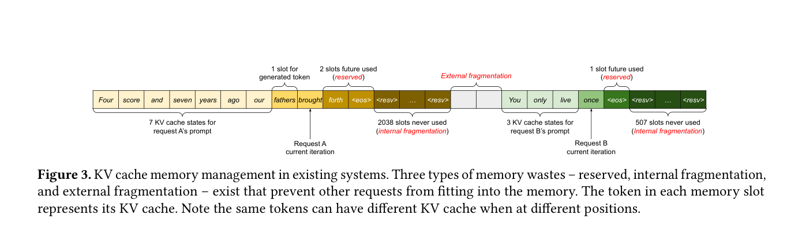
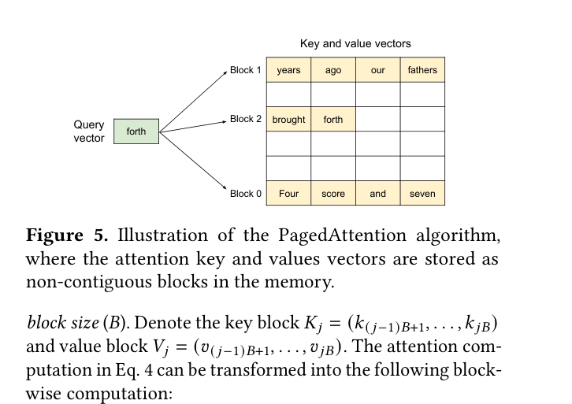
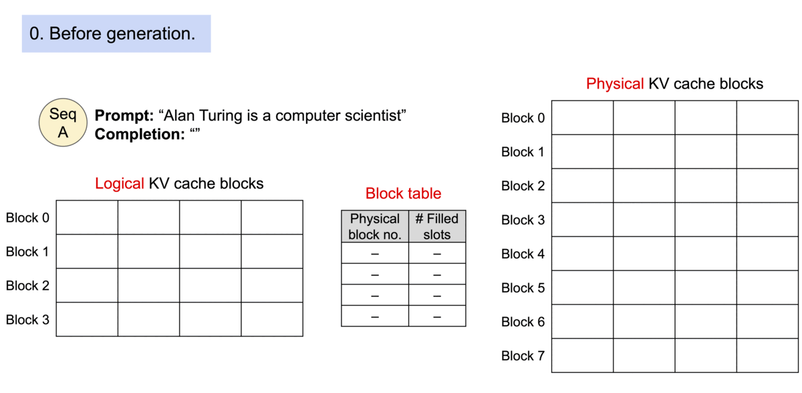
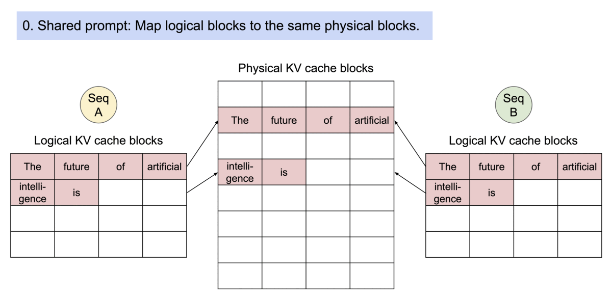
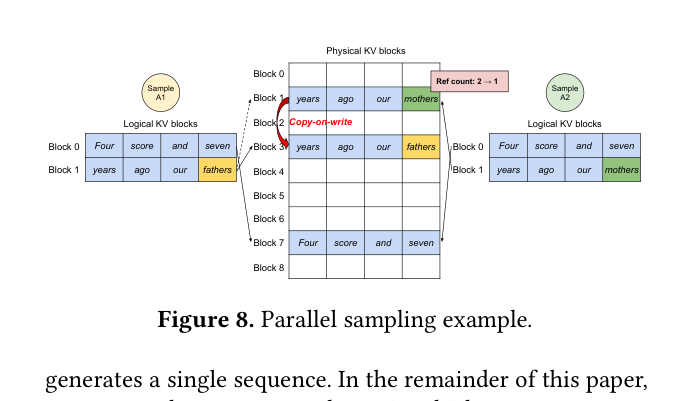
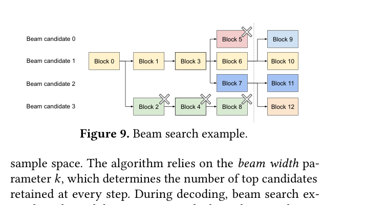

# vLLM & PagedAttention: Memory Revolution in LLM Inference

> Based on [Efficient Memory Management for Large Language Model Serving with PagedAttention](https://arxiv.org/abs/2309.06180) (SOSP '23, UC Berkeley). Source code: [github.com/vllm-project/vllm](https://github.com/vllm-project/vllm)

These are study notes for the paper. The goal: after reading this, you should have an intuitive grasp of every technique PagedAttention uses — without needing to read the paper itself.

## Why PagedAttention?

The core bottleneck in LLM inference is **memory**, and the largest dynamic memory cost comes from the **KV Cache**.

Take a 13B-parameter OPT model on an NVIDIA A100 40GB GPU:
- **Model parameters** take 65% (26 GB), fixed throughout inference
- **KV Cache** takes >30%, growing and shrinking dynamically per request
- The rest is temporary activation memory used only during computation


### Memory Waste in Existing Systems

Existing LLM serving systems (e.g. FasterTransformer, Orca) store each request's KV cache in **contiguous memory** pre-allocated at the **maximum possible length**. This causes three types of waste:

| Waste Type | Description | Severity |
|---|---|---|
| **Reserved** | Space reserved for future tokens of a request — unusable by others for the request's lifetime. **Will be used eventually, but not now.** | Up to the entire allocated block |
| **Internal Fragmentation** | Actual sequence length far shorter than the pre-allocated maximum — remaining space never used | Significant |
| **External Fragmentation** | Variable-size allocations leave gaps that other requests cannot use | Significant |



Paper measurements: in existing systems, **effective KV cache memory utilization can be as low as 20.4%**. vLLM brings this up to **96.3%**.


## PagedAttention: Block-wise Attention Algorithm

### Core Idea: Analogy to OS Virtual Memory

PagedAttention draws inspiration from the OS **virtual memory paging** mechanism:

| OS Concept | PagedAttention Equivalent |
|---|---|
| Virtual Page | Logical KV Block |
| Physical Page Frame | Physical KV Block |
| Page Table | Block Table |
| Process | Sequence |
| Page Size | Block Size (e.g. 16 tokens) |

Just as the OS doesn't require a process's virtual address space to be contiguous in physical memory, PagedAttention doesn't require a sequence's KV cache to be contiguous in GPU memory.

### The Block Concept

PagedAttention partitions each sequence's KV cache into fixed-size **KV Blocks**. Each block stores the keys and values for a fixed number of tokens (block size $B$, default 16):

$$K_j = (k_{(j-1)B+1}, \ldots, k_{jB}), \quad V_j = (v_{(j-1)B+1}, \ldots, v_{jB})$$

### Block-wise Attention Computation

The standard self-attention formula is:

$$a_{ij} = \frac{\exp(q_i^\top k_j / \sqrt{d})}{\sum_{t=1}^{i} \exp(q_i^\top k_t / \sqrt{d})}, \quad o_i = \sum_{j=1}^{i} a_{ij} v_j$$

PagedAttention reformulates this as a **block-wise** computation:

$$A_{ij} = \frac{\exp(q_i^\top K_j / \sqrt{d})}{\sum_{t=1}^{\lceil i/B \rceil} \exp(q_i^\top K_t \mathbf{1} / \sqrt{d})}, \quad o_i = \sum_{j=1}^{\lceil i/B \rceil} V_j A_{ij}^\top$$

where $A_{ij}$ is the attention score row-vector for the $j$-th KV block.

The key change: the attention kernel no longer reads K/V vectors sequentially — it **reads block by block**, and each block can reside anywhere in GPU memory.



<HtmlVisualization
  src="/machine-learning/inference/visualizations/paged-attention-computation.html"
  height="560px"
  title="PagedAttention Block-wise Computation"
/>

### Decoding Process Animation

The animation below shows how PagedAttention dynamically manages the KV cache during decoding:


Each time a new token is generated, the PagedAttention kernel reads K/V vectors from different physical blocks, computes attention scores, and produces the weighted output. These blocks **need not be contiguous** in physical memory.

## KV Cache Manager: Virtual Memory-style Mapping

### Block Table = Page Table

vLLM's KV cache manager maintains a **Block Table** (analogous to an OS page table), recording the mapping from each sequence's logical blocks to physical blocks.

<HtmlVisualization
  src="/machine-learning/inference/visualizations/kv-cache-block-table.html"
  height="560px"
  title="KV Cache Block Table Mapping"
/>

Each block table entry records:
- The **logical block number** → **physical block number** mapping
- The **number of filled slots** in each logical block

### Dynamic Allocation Process

Consider a sequence with prompt "Four score and seven years ago our fathers brought" (block size = 4):

**① Prefill phase**: the prompt has 9 tokens. vLLM allocates 3 logical blocks (blocks 0–2), mapped to physical blocks 7, 1, 3. Blocks 0 and 1 each hold 4 tokens; block 2 holds 1 token (3 slots reserved).

**② First decode**: a new token "forth" is generated. Block 2 still has space — written directly, fill count updated.

**③ Subsequent decodes**: only when the last block fills up does vLLM allocate a new physical block — **growing on demand**, no pre-reservation required.




::: info Key Advantage
Compared to traditional systems, vLLM limits memory waste to **at most one block per sequence** (the unfilled tail of the last block), rather than the full pre-allocated window. This is the core reason vLLM raises memory utilization from ~20% to ~96%.
:::

## Applications to Complex Decoding Scenarios

### Parallel Sampling

**What is parallel sampling?** Given the same input prompt, the LLM generates **multiple different candidate outputs**, and the user picks the best one. Common in code completion, creative writing, etc.

**Relation to CoT (Chain of Thought)**: A popular CoT strategy is **self-consistency** — generating multiple reasoning chains (i.e. parallel sampling) for the same question, then picking the most consistent answer by majority vote. Parallel sampling is the infrastructure that makes multi-path CoT possible.

**vLLM's advantage**: all candidates share the same prompt, so the prompt's KV cache **only needs to be stored once**. vLLM achieves this by mapping multiple sequences' logical blocks to the **same physical block**, using **reference counting** to track how many sequences share each physical block.


When a candidate sequence needs to write a new token to a shared last block, vLLM uses **Copy-on-Write**:

1. Detect that the physical block's reference count > 1
2. Allocate a new physical block and copy the original block's data
3. Write the new token into the new block
4. Decrement the original block's reference count

In one sentence: **only copy a block when you actually need to write to it. Until then, the shared block is treated as read-only and stored once — similar to pointer sharing.**





::: tip Memory Savings
Paper measurements: parallel sampling saves **6.1%–9.8%** of KV block memory (Alpaca dataset). Savings increase with prompt length.
:::

### Beam Search

**What is beam search?** Beam search keeps the **top-k most likely candidate sequences** at each decoding step (k = beam width). Widely used in machine translation and other tasks requiring high output quality. Each token has a selection probability; beam search multiplies probabilities across positions and keeps the top-k candidates with the highest joint probability at each step.

**Relation to CoT**: If parallel sampling does "explore then select" at the **sequence level** (generate full chains then pick), beam search does "explore then prune" at the **token level** (keep the top-k paths at every step). Both are multi-path exploration at different granularities.

**vLLM's advantage**: beam search candidates share even more blocks (not just the prompt, but also overlapping generated prefixes), and the sharing pattern **changes dynamically** as decoding progresses (similar to a process-tree created by OS `fork`).

Paper measurements: beam search memory sharing saves **37.6%–55.2%** (Alpaca dataset) — far more than parallel sampling, because beam candidates overlap more.



## Scheduling and Preemption

### Eviction Policy: All-or-Nothing

When GPU memory is exhausted, vLLM must evict some sequences' KV cache. Unlike OS paging (which can evict individual pages), vLLM uses an **All-or-Nothing** policy:

- **All blocks belonging to one sequence are evicted together** — because all tokens of a sequence are needed the next time it generates
- Multiple sequences form a **sequence group** (e.g. all beam search candidates), and **the entire group is evicted/scheduled together**
- This preserves intra-group memory sharing relationships

Scheduling follows **FCFS (First-Come, First-Served)**: earlier requests are kept, newest requests are preempted first.

### Swapping (GPU → CPU)

Swapping moves an evicted sequence's KV cache blocks from GPU memory **to CPU memory**.

<HtmlVisualization
  src="/machine-learning/inference/visualizations/swapping-timeline.html"
  height="600px"
  title="Swapping Timeline: GPU ↔ CPU Transfer"
/>

Full flow:

1. **Trigger**: GPU physical blocks exhausted during token generation
2. **Select eviction target**: pick a sequence group in reverse FCFS order
3. **Swap Out**: move all blocks of that group from GPU to CPU
4. **Continue serving**: other requests keep generating
5. **Release**: a completed request frees its physical blocks
6. **Swap In**: the previously swapped sequence's blocks move back to GPU, generation resumes

::: warning CPU Memory Requirement
A key design property: **CPU memory demand never exceeds the GPU memory allocated for KV cache**.

The reason is simple: all swapped-out data came from the GPU's KV cache region — the number of evicted blocks can never exceed the total physical blocks on the GPU. So the CPU swap space needed is **bounded by the GPU's KV cache allocation**.

For example: if an A100 40GB allocates 12 GB for KV cache, the CPU needs at most 12 GB of swap space.
:::

### Recomputation

Another way to recover evicted KV cache is **recomputation**: instead of saving the preempted sequence's KV cache, recompute it when needed.

**Why is recomputation much faster than expected?**

There's a counterintuitive but crucial insight here:

::: tip Key Insight: Recomputation Enters Prefill Phase
Consider a conversation:
- User prompt: **100 tokens**
- Model has auto-regressively generated: **5,000 tokens**

**Original generation process**:
- 100-token **prefill** (parallel matrix multiply, fast)
- \+ 5,000 **decode** steps (1 token per step, autoregressive, slow)

**Recomputation process**:
- Concatenate original prompt + 5,000 generated tokens = **5,100 tokens as input**
- Run a single **5,100-token prefill** (parallel matrix multiply, done in one shot!)

Prefill processes all tokens in parallel (large matrix multiply) — no need for autoregressive step-by-step generation. So a 5,100-token prefill is **far faster** than 100-token prefill + 5,000 decode steps.
:::

**Why is recomputation actually faster than swapping at small block sizes?**

This requires understanding the real cost breakdown of PCIe transfers:

$$\text{swap cost} \approx N_{\text{transfers}} \times \text{latency}_{\text{fixed}} + \frac{\text{total bytes}}{\text{PCIe BW}}$$

Every GPU↔CPU transfer has a **fixed per-transfer latency**, independent of data size. With small block sizes (e.g. 4 tokens), each block carries very little data but still incurs the full fixed latency — like making many trips in a truck but carrying almost nothing each time. PCIe bandwidth utilization is terrible.

Recomputation cost, by contrast, only depends on **sequence length** — completely independent of how the KV cache is chunked:

$$\text{recompute cost} \approx f(\text{sequence length}) \quad \text{(independent of block size)}$$

| Block size | Swap efficiency | Recompute efficiency | Winner |
|---|---|---|---|
| 4–16 | Low (many small transfers, fixed latency dominates) | Unchanged | Recompute |
| ~32–64 | Medium (comparable to recompute) | Unchanged | Tie |
| 128+ | High (few large transfers, bandwidth well utilized) | Unchanged | Swap |

Paper results (Fig. 19):
- Block size < 32: recomputation wins
- Block size > 64: swapping wins
- Block size 16–64: roughly equal
- Recomputation overhead is **independent of block size** (no KV block I/O involved)

## Distributed Execution

### Megatron-LM Style Tensor Model Parallelism

When the model is too large for a single GPU, it must be **split** across multiple GPUs. vLLM uses Megatron-LM style **tensor model parallelism**.

**What is Tensor Parallelism?** Split the Transformer's **weight matrices along a dimension** across GPUs. For the attention layer, this means **distributing different attention heads to different GPUs**:

- E.g. a model with 32 attention heads across 4 GPUs
- GPU 0 handles heads 0–7, GPU 1 heads 8–15, GPU 2 heads 16–23, GPU 3 heads 24–31
- Each GPU holds 1/4 of the attention weight matrices ($W_Q$, $W_K$, $W_V$, $W_O$ column slices)

### SPMD (Single Program Multiple Data)

vLLM uses the **SPMD execution model**: all GPUs run **the same program** but process **different data** (their assigned subset of attention heads).

Execution flow:
1. **Scheduler broadcast**: sends the same input token IDs and block table to all GPU workers
2. **Embedding lookup**: each GPU independently looks up embeddings from its local copy of the full embedding table, yielding the same input vector X on all GPUs
3. **Independent computation**: each GPU multiplies its weight shard (column slice of W_Q/W_K/W_V) by the full input X to compute Q/K/V for its assigned heads
4. **All-Reduce sync**: after attention and FFN, **NCCL** all-reduce merges each GPU's partial outputs
5. **Return result**: GPU workers send the sampled token back to the scheduler

::: info What is NCCL?
**NCCL (NVIDIA Collective Communications Library)** is NVIDIA's multi-GPU communication library, optimized for **collective operations** in deep learning.

The most common operation is **All-Reduce**: each GPU contributes a partial result; NCCL sums all contributions and returns the result to every GPU. In tensor parallelism, one All-Reduce is needed after each attention/FFN layer to merge partial outputs.

NCCL automatically selects the best communication path:
- **NVLink** (direct on-node): ~600 GB/s — used first
- **PCIe** (on-node, no NVLink): ~32 GB/s
- **RDMA/InfiniBand** (cross-node): ~200 GB/s

**Note**: input token transfer does NOT go through NCCL — the scheduler sends token IDs directly. NCCL is only responsible for merging intermediate results after each layer's computation.
:::

Key property: **GPU workers do not need to synchronize memory management information.** They only need to receive the scheduler-broadcast block table at the start of each decoding iteration.

### Distributed KV Cache Management

<HtmlVisualization
  src="/machine-learning/inference/visualizations/tensor-parallelism-kv.html"
  height="600px"
  title="KV Cache Distribution under Tensor Parallelism"
/>

Under tensor parallelism, KV cache distribution follows one simple rule:

> **Each attention head's KV cache lives on the GPU that processes that head.**

- GPU 0 handles heads 0–7 → GPU 0's memory stores K/V cache for heads 0–7
- GPU 1 handles heads 8–15 → GPU 1's memory stores K/V cache for heads 8–15
- And so on

**Unified mapping mechanism**:

Although KV cache is scattered across GPUs, the **block table is managed centrally by the scheduler**:

- All GPUs share the **same block table** (consistent logical → physical block mapping)
- Each GPU has its own **block engine** that manages local physical memory
- Input tokens are **the same on all GPUs** (each GPU needs the full input to compute its assigned attention heads)
- Logical block numbers are unified across all GPUs; each GPU's physical block simply stores the KV data for the heads it is responsible for

From the paper:

> *The KV cache manager in each GPU worker independently manages the KV cache in its own GPU memory. However, the mapping between logical and physical KV blocks is consistent across GPU workers, as the scheduler sends the same block table to all workers.*

**Block table capacity question**: if each GPU has 100 physical blocks and you have 4 GPUs (400 physical blocks total), how many entries does the block table have?

The answer is **100**, not 400. Reason: allocating 1 logical block causes the scheduler to **simultaneously occupy 1 physical block on each of the 4 GPUs** (each stores the KV for that block's tokens for its assigned heads). The relationship is "one logical block → one physical block per GPU":

```
logical block 0 → physical block 7 (allocated simultaneously on all GPUs)
  GPU 0: physical block 7 stores K/V for heads 0-7,  tokens 1-16
  GPU 1: physical block 7 stores K/V for heads 8-15, tokens 1-16
  GPU 2: physical block 7 stores K/V for heads 16-23,tokens 1-16
  GPU 3: physical block 7 stores K/V for heads 24-31,tokens 1-16
```

| Dimension | Count |
|---|---|
| Block table entries (logical block cap) | **100** |
| Total physical blocks consumed | **4 × 100 = 400** |
| Physical blocks consumed per logical block allocation | **4** (one per GPU) |

::: warning More GPUs ≠ More Token Capacity
Under tensor parallelism, adding GPUs expands **model capacity and compute throughput** — not KV cache token capacity. 4 GPUs × 100 blocks serves the same number of tokens as 1 GPU × 100 blocks; the KV data per block is simply spread across more cards.
:::

::: info Why no KV cache copying across GPUs?
Each GPU only needs the KV cache for its own attention heads. Head A's KV cache is computed and used exclusively on the GPU handling Head A — **no transfer to other GPUs needed**.

GPU-to-GPU communication only happens during the all-reduce phase (syncing attention and FFN outputs), not at the KV cache level. This significantly reduces inter-GPU traffic.
:::

## Summary

vLLM's core contribution is bringing mature **OS virtual memory management** ideas into LLM serving:

| Technique | Effect |
|---|---|
| **PagedAttention** | KV cache needs no contiguous storage — near-zero waste |
| **Block Table Mapping** | Dynamic allocation, on-demand growth, eliminates reservation waste |
| **Copy-on-Write** | Efficient KV cache sharing for parallel sampling and beam search |
| **All-or-Nothing Eviction** | Unified group scheduling preserves sharing relationships |
| **Swapping + Recomputation** | Two complementary KV cache recovery strategies |
| **Distributed KV Cache Management** | Unified block table, supports tensor parallelism |

Measured results: vLLM improves LLM serving throughput by **2–4×** with no impact on model accuracy, with larger gains in complex decoding scenarios.
