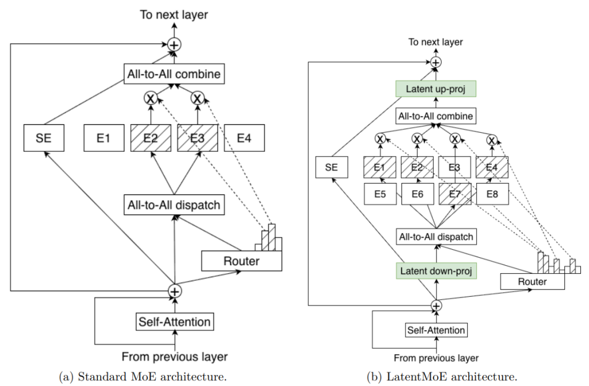
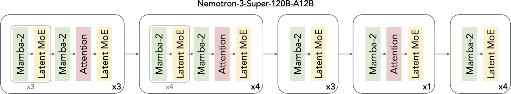
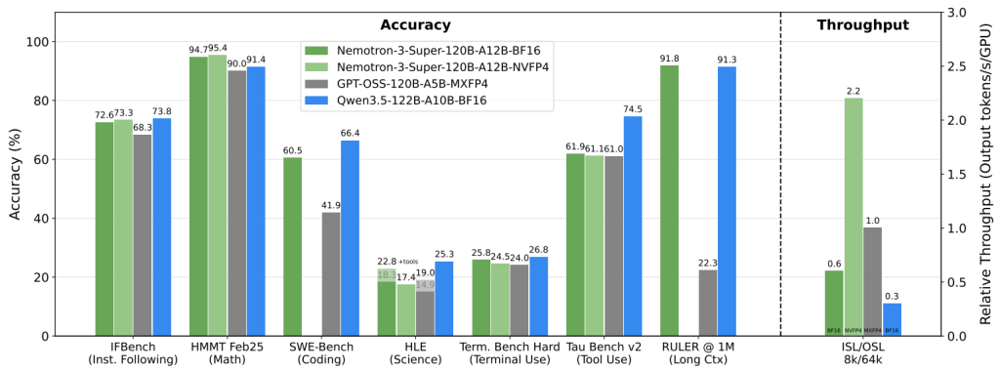

# Nemotron 3 Super: A Mamba + Transformer + Latent MoE Hybrid Architecture

> In March 2026, NVIDIA open-sourced **Nemotron 3 Super** — a hybrid architecture model with 120B total parameters and 12B active parameters, natively supporting a **1M token context**, scoring **85.6%** on the agentic reasoning benchmark PinchBench and taking the top spot among open models in its class. This post breaks down the three building blocks behind it, and why the mainstream architecture of 2026 is no longer pure Transformer.

## The 2026 architectural shift

For the past 7 years, LLMs have basically been built on top of Transformers. But Q1 2026 produced a clear cluster of signals that **the mainstream architecture is moving away from pure Transformer**:

| Model | Release | Architecture | Total params |
|---|---|---|---|
| Jamba 1.5 (AI21) | 2024 | Mamba + Attention + MoE | 398B |
| Hunyuan-TurboS (Tencent) | 2026-01 | Transformer + Mamba-2 + MoE | 560B |
| **Nemotron 3 Super (NVIDIA)** | **2026-03** | **Mamba-2 + Attention + Latent MoE** | **120B** |
| Falcon H3 (TII) | 2026-02 | Attention-free (pure SSM) | 40B |

There is only one core driver: **at long context, Transformer's quadratic complexity is too expensive**.

For a 1M token context, standard attention requires $O(N^2) = 10^{12}$ operations and stores an $O(N^2)$ attention matrix. Even the most optimized FlashAttention can't hold up on inference latency and memory footprint.

The advantage of **Mamba-style State Space Models (SSMs)** is **$O(N)$ complexity** — no matter how long the sequence gets, compute and storage per token stay constant. But SSMs underperform attention on **precise retrieval (needle-in-haystack)** tasks.

The **hybrid architecture** idea: take the best of both.

## Building block 1: what Mamba-2 actually does

The intuition for a **State Space Model (SSM)** is something like **RNN + a learnable dynamical system**. Standard SSMs treat sequence processing as a linear dynamical system:

$$
h_t = A h_{t-1} + B x_t
$$
$$
y_t = C h_t
$$

where $h_t$ is the hidden state, $x_t$ is the current token, and $A, B, C$ are learnable matrices.

**Mamba's key innovation** is the **selective SSM**: $B$ and $C$ are no longer fixed parameters, but **functions of the current token**:

$$
B_t = f_B(x_t), \quad C_t = f_C(x_t)
$$

This lets the model **selectively attend to or ignore** past history based on the current token — and this is what first let SSMs beat Transformers on language tasks.

**Mamba-2** builds on Mamba by introducing **structured diagonal $A$ matrices** and **matrix-form parallel training** — preserving $O(N)$ inference complexity while enabling training acceleration via matrix multiplication (rather than per-token scanning).

### Mamba-2 vs Attention head-to-head

| Property | Attention | Mamba-2 |
|---|---|---|
| Inference complexity | $O(N^2)$ or $O(N)$ (with KV cache) | $O(N)$ |
| Training complexity | $O(N^2)$ | $O(N \log N)$ |
| Long-sequence memory | $O(N)$ (KV cache) | $O(1)$ (fixed hidden state) |
| Precise retrieval | Strong | Weak |
| Needs position encoding | Yes | No (implicit in state evolution) |

## Building block 2: Latent MoE's compressed routing

The other major innovation in Nemotron 3 Super is **Latent MoE** — pushing Mixture-of-Experts to an even more extreme level of parameter efficiency.

### The problem with traditional MoE

How a standard MoE (Mixtral, DeepSeek-V3) works:

1. A gating network decides which experts each token routes to
2. The selected experts run computation at full dimensionality (typically $d_{model} = 4096$)
3. Results are weighted and summed

**The problem**: experts have to operate at the full $d_{model}$, so as you add experts the parameter count $\propto N_{experts} \times d_{model}^2$ blows up fast.

### What Latent MoE does

Nemotron 3 Super adds a **dimension-reducing compression** before expert routing:

```
token (4096-dim) 
    ↓ project down
  latent (1024-dim)
    ↓ route to experts
  experts (work in 1024-dim)
    ↓ combine
  latent result (1024-dim)
    ↓ project up
  output (4096-dim)
```

Experts compute in the compressed low-dimensional latent space, then project back to the original dimension.



**Key advantages**:

- Under the same compute budget, you can fit **4x more experts**
- Each expert is smaller and finds specialized features more easily
- The projection matrices are a small shared parameter overhead and don't break parameter efficiency

## Nemotron 3 Super's layered structure

The full model is built by stacking **5 repeated blocks**. Each block is fixed at 6 layers:

```
Block structure (6 layers per block, 5 repetitions):
  Layer 1: Mamba-2
  Layer 2: Latent MoE
  Layer 3: Mamba-2
  Layer 4: Attention       ← the only attention layer
  Layer 5: Mamba-2
  Layer 6: Latent MoE
```



**Design philosophy**:

- **Mamba-2 dominates layer count (3 per block)**: handles most of the sequence processing, keeps inference at $O(N)$
- **Attention is sparsely inserted (1 per block, 5 total)**: handles precise recall and long-range dependencies
- **Latent MoE layers (2 per block)**: provide parameter scale and specialization capacity

### Why is attention only placed in the middle?

This is an empirical engineering decision. The research team found:

- Too early: the model hasn't built up enough contextual representation yet, so attention isn't accurate enough
- Too late: attention's output gets over-compressed by subsequent Mamba layers
- **The middle position (layer 4) is the sweet spot**: Mamba has already distilled good representations, attention can do precise association, and the remaining Mamba layers still have enough capacity to aggregate

This matches conclusions from **Anthropic's and OpenAI's interpretability research**: middle layers are where LLMs form "meaning."

## Multi-Token Prediction (MTP): decoding speedup

Nemotron 3 Super also uses **MTP** — each forward pass predicts multiple future tokens, instead of just the next one.

**Traditional autoregressive decoding**:

```
x₁ x₂ x₃ → predict x₄  (1 forward)
x₁ x₂ x₃ x₄ → predict x₅  (1 forward)
```

**MTP decoding**:

```
x₁ x₂ x₃ → predict x₄, x₅, x₆  (1 forward)
```

**Design details**:

- **Weight-shared MTP heads**: all prediction heads share lower-level parameters, only the final projection differs
- **Jointly optimized during training**: the 4 prediction heads train together, effectively multi-task learning
- **Speculative verification at inference**: the generated x₄, x₅, x₆ are used as speculative decoding draft tokens; forwards are only skipped when all are accepted

**Measured effect**: **3x wall-clock speedup** on structured generation tasks (code, tool calls).

## Training recipe

| Stage | Scale | Notes |
|---|---|---|
| Pre-training | **25T tokens (NVFP4 precision)** | Of which 10T are unique curated data + 10B dedicated reasoning + 15M programming problems |
| SFT | 7M samples | Filtered from 40M candidates, covering reasoning / instructions / code / safety / multi-step agent |
| RL | 21 environment configurations | 1.2M rollouts generated via NeMo Gym + NeMo RL |

**Details worth noting**:

- Pre-training runs directly in **NVFP4** precision — this wasn't feasible before 2026 because there was no sufficiently stable training framework. Rubin hardware and the third-generation Transformer Engine made it possible
- The RL environments are diverse, including tool use, code execution, multi-turn dialog — not just RLHF

## Benchmark performance

| Task | Nemotron 3 Super | GPT OSS 120B | Qwen3 122B |
|---|---|---|---|
| PinchBench (agentic) | **85.6%** | 78.2% | 74.5% |
| Inference throughput (vs previous Nemotron Super) | **5x** | — | — |

Among open models in its class, Nemotron 3 Super is **the strongest** on agentic reasoning — which is exactly its design target: **optimized for long-horizon agent tasks**.



## Why this is the "next-generation" architecture

Nemotron 3 Super matters because it simultaneously addresses the **three core pain points** of LLM development in 2026:

### Pain point 1: thinking tax

Inference-time scaling (the o1, DeepSeek-R1 style) brings a new cost problem — the model has to "think" longer, dramatically increasing compute per user request.

**Nemotron 3's answer**: the hybrid architecture delivers 5x higher inference throughput than its predecessor. Cheaper "thinking" means you can afford more reasoning steps.

### Pain point 2: context explosion

Agent tasks need to maintain long history contexts — tool returns, intermediate reasoning, planning state... easily over 100K.

**Nemotron 3's answer**: native 1M context + Mamba-2's $O(N)$ complexity, so long context is no longer a premium feature.

### Pain point 3: expert specialization trade-off

Traditional MoE: more experts blow up parameters, fewer experts can't learn enough specialization.

**Nemotron 3's answer**: Latent MoE runs experts in compressed space, making "many experts + low cost" actually work for the first time.

## My take

If I had to summarize the 2026 shift in LLM architecture in one sentence:

> **Transformer is no longer the only answer; hybrid architecture has become mainstream.**

But this isn't a replacement of Transformer — it's a **fusion** of Transformer + SSM + sparse computation:

- Mamba-2 solves the long-context complexity problem
- Attention solves precise retrieval
- Latent MoE solves parameter efficiency
- MTP solves decoding throughput

Directions worth watching next:

1. **Mamba-3**: an improved version that appeared on OpenReview in April 2026, pushing expressiveness further
2. **Optimal hybrid ratio**: what's the best mix of Mamba and Attention? No consensus in the field yet
3. **Maturation of the training stack**: native NVFP4 training, parallelized RL environments — this infrastructure is currently owned by only a handful of teams

If you're interested in LLM architecture evolution, recommended reading order:

1. [3Blue1Brown: What is ChatGPT doing](./chatgpt-overview-3blue1brown.md) — the Transformer foundation
2. This post — the 2026 state of hybrid architectures
3. [vLLM & PagedAttention](../inference/vllm-pagedattention.md) — how these architectures are supported by inference engines

## References

- [Introducing Nemotron 3 Super (NVIDIA Developer Blog)](https://developer.nvidia.com/blog/introducing-nemotron-3-super-an-open-hybrid-mamba-transformer-moe-for-agentic-reasoning/)
- [Mamba: Linear-Time Sequence Modeling with Selective State Spaces](https://arxiv.org/abs/2312.00752)
- [Mamba-2: Structured State Space Duality](https://arxiv.org/abs/2405.21060)
- [Jamba-1.5 Hybrid Transformer-Mamba (AI21)](https://www.ai21.com/blog/announcing-jamba/)
- [Hybrid Architectures for Language Models: Systematic Analysis and Design Insights](https://arxiv.org/html/2510.04800v1)
- [Attention was never enough: Tracing the rise of hybrid LLMs (AI21)](https://www.ai21.com/blog/rise-of-hybrid-llms/)
