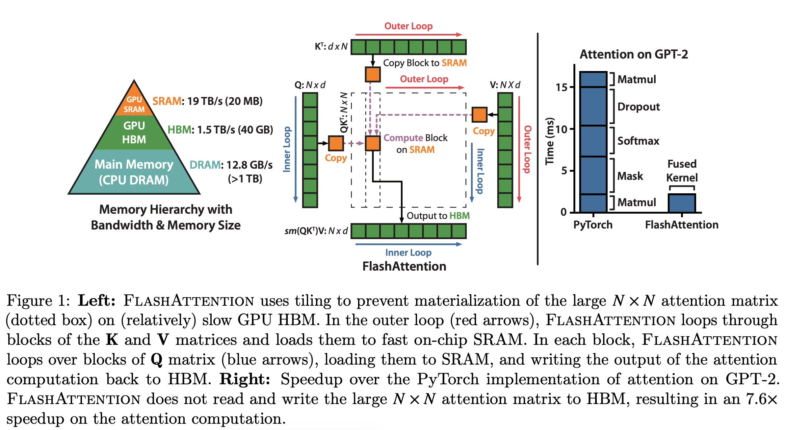
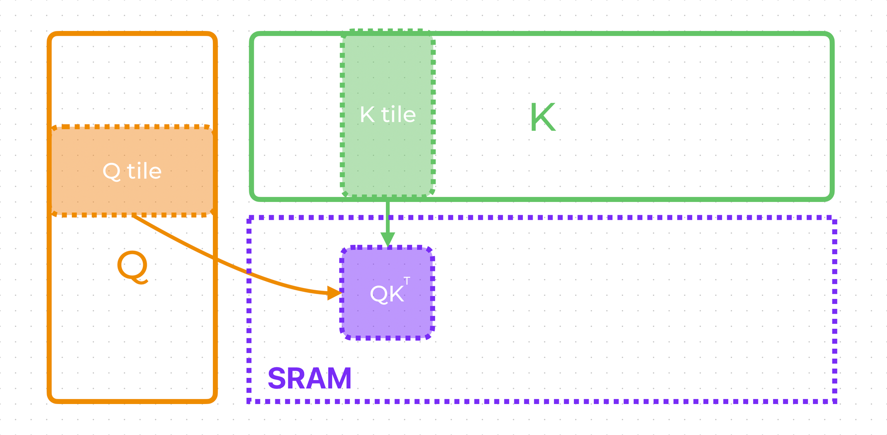

# FlashAttention：从 IO-aware 视角理解注意力如何加速推理

> 本文基于论文 [FlashAttention: Fast and Memory-Efficient Exact Attention with IO-Awareness](https://arxiv.org/abs/2205.14135)（Tri Dao et al., 2022）。
>
> 写这篇文章的目的是做论文的学习笔记，希望你看完之后能够**直观地**理解 FlashAttention 用到的每一个技巧，知道它为什么快、为什么省显存，而且为什么算出来的结果和原始 attention 一模一样（exact，不是近似）。

## 一句话总结

标准 attention 慢，不是因为算得多，而是因为**搬数据搬得多**：它会把一个 $N \times N$ 的中间矩阵反复写进、读出 GPU 的高带宽显存（HBM）。FlashAttention 的做法是——**把注意力计算分块（tiling），让中间结果始终待在又快又小的片上 SRAM 里，永远不把那个 $N \times N$ 矩阵落地到 HBM**。结果完全相同，但 HBM 读写大幅减少，于是更快、更省显存。

难点只有一个：softmax 需要看到**整行**的所有分数才能归一化，怎么能分块？答案是 **online softmax**——一边流式处理一边维护几个累计量。这篇文章的后半部分就专门讲这个。

## 一、推理慢在哪：标准 attention 的内存往返

回顾标准的（缩放点积）注意力：

$$
S = QK^\top, \quad P = \mathrm{softmax}(S), \quad O = PV
$$

其中 $Q, K, V \in \mathbb{R}^{N \times d}$，$N$ 是序列长度，$d$ 是 head dimension。注意中间矩阵 $S$ 和 $P$ 的大小都是 $N \times N$。

当 $N = 4096$ 时，一个 $N \times N$ 的矩阵就有 1600 万个元素；序列再长一点，这个矩阵会比 $Q/K/V$ 本身大得多。标准实现（包括朴素的 PyTorch 实现）会：

1. 算出 $S = QK^\top$，**把整个 $N \times N$ 写回 HBM**；
2. 从 HBM 读回 $S$，做 softmax，**再把 $N \times N$ 的 $P$ 写回 HBM**；
3. 从 HBM 读回 $P$，和 $V$ 相乘得到 $O$。

问题就在这一连串"写回 HBM → 再读回来"。GPU 的算力（FLOPs）这些年涨得飞快，但显存带宽涨得慢，于是**attention 这种算子是 memory-bound（受显存带宽限制）而不是 compute-bound（受算力限制）**——GPU 的计算单元大部分时间在等数据从 HBM 搬过来。

下面这张论文 Figure 1 的右图非常直观：在 GPT-2 上做 attention，PyTorch 实现里 softmax、dropout、mask 这些"看起来很便宜"的逐元素算子其实占了大部分时间——因为它们的瓶颈不是算，而是在 HBM 上读写那个大矩阵。FlashAttention 把这些操作**融合（fuse）**进一个 kernel，时间一下就压下来了。



## 二、关键背景：GPU 的内存层级

要理解 FlashAttention 为什么这样设计，得先看上面那张图的**左侧三角形**——GPU 的内存层级：

| 层级 | 带宽 | 容量 | 特点 |
| --- | --- | --- | --- |
| **SRAM**（片上，on-chip） | ~19 TB/s | ~20 MB | 极快，但极小 |
| **HBM**（GPU 显存） | ~1.5 TB/s | ~40 GB | 大，但比 SRAM 慢一个数量级 |
| **DRAM**（CPU 主存） | ~12.8 GB/s | >1 TB | 更大，更慢 |

关键事实：**SRAM 比 HBM 快约 10 倍，但容量只有它的两千分之一**。那个 $N \times N$ 的注意力矩阵根本塞不进 SRAM，所以标准实现只能把它放在 HBM 里，于是产生大量慢速读写。

FlashAttention 的核心思路就是顺着这个层级结构来设计算法：**只把小块数据搬进 SRAM，在 SRAM 内部把能算的都算完，绝不把大矩阵写回 HBM**。这种"以减少慢速内存读写为第一目标"的设计哲学，就是论文标题里的 **IO-aware（IO 感知）**。

## 三、技巧一：Tiling（分块）

既然整个 $N \times N$ 放不进 SRAM，那就**分块**。把 $Q$、$K$、$V$ 都切成小块（tile），每次只把几个 tile 搬进 SRAM，算出这一小块对应的部分结果。

下面这张图展示了最基本的一步：取出 $Q$ 的一个 tile（若干行）和 $K$ 的一个 tile（若干列），搬进 SRAM，在 SRAM 里算出它们的局部 $QK^\top$ 小块：



对应到论文 Figure 1 左图的循环结构：

- **外层循环（红色箭头）**：遍历 $K$、$V$ 的 block，逐块加载到 SRAM；
- **内层循环（蓝色箭头）**：遍历 $Q$ 的 block，逐块加载到 SRAM，和当前的 $K/V$ block 计算，再把这一步的输出累加回 HBM 上的 $O$。

这样一来，每个时刻 SRAM 里只有几个小 tile，以及一小块局部分数——大矩阵 $S$、$P$ 从头到尾**不存在于 HBM**。

但这里立刻冒出一个棘手的问题：**softmax 需要一整行的全部分数才能归一化**（分母是这一行所有 $e^{s_j}$ 的和，还要先减去这一行的最大值来保证数值稳定）。可现在我们一次只看到 $K$ 的一个 block，也就是一行里的一小段分数，怎么做 softmax？

这就要靠技巧二。

## 四、技巧二：Online Softmax（在线 softmax）

### 先回顾：数值稳定的 softmax 要做两遍扫描

对一行分数 $s_1, \dots, s_N$，数值稳定的 softmax 是：

$$
m = \max_j s_j, \qquad
p_j = \frac{e^{s_j - m}}{\sum_{k} e^{s_k - m}}
$$

减去最大值 $m$ 是为了防止 $e^{s_j}$ 溢出。注意这需要**先扫一遍求出 $m$ 和分母，再扫一遍算每个 $p_j$**——本质上要看到整行。

Online softmax 的精髓在于：**我们不需要真的等到看完整行**。可以一边流式地处理一个个 block，一边维护"到目前为止的累计状态"，每来一个新 block 就把它合并进来。处理完最后一个 block，得到的结果和一次性看完整行**完全相等**。

### 维护三个 running state（累计状态）

对每个 query 行（实际 kernel 里是 $Q$ tile 的每一行），只维护三个累计量：

```text
m  : 到目前为止所有已处理 K block 里的最大分数
l  : 在当前 m 基准下，累计的 softmax 分母（∑ e^{s_j - m}）
z  : 在当前 m 基准下，累计的加权 value 分子（∑ e^{s_j - m} · v_j）
```

注意这是一个 **cumulative（累计）** 的过程：我们**不**保存每个历史 block 各自的 $(m, l, z)$，只保存一份"把所有历史 block 压缩进去的"累计状态。这份状态对最终结果而言是**无损的**——因为算 attention 输出根本不需要知道每个历史 block 各自的贡献，只需要知道历史整体的最大值、分母、分子。

它们的形状（设 $Q$ tile 有 $B_q$ 行，$V$ 的维度是 $d_v$）：

```text
m : [B_q]        每行一个标量
l : [B_q]        每行一个标量
z : [B_q, d_v]   每行一个向量（注意 z 不是 N×N 矩阵！）
```

**这正是省显存的关键**：我们存的是 $O(B_q \cdot d_v)$ 的累计状态，而不是 $O(N^2)$ 的注意力矩阵。

### 合并一个新 block：四步

初始化 $m = -\infty,\ l = 0,\ z = 0$。当新的 $(K, V)$ block 到来：

**第 1 步**：算出这个 block 自己的局部分数 $S_{\text{block}} = Q\,K_{\text{block}}^\top$，取这一段的最大值，并更新全局最大值：

$$
m_{\text{block}} = \max(S_{\text{block}}), \qquad
m_{\text{new}} = \max(m_{\text{old}},\ m_{\text{block}})
$$

**第 2 步**：把旧的累计状态从旧基准 $m_{\text{old}}$ 调整到新基准 $m_{\text{new}}$。缩放因子是

$$
\alpha = e^{\,m_{\text{old}} - m_{\text{new}}}
$$

**第 3 步**：把新 block 的贡献（以 $m_{\text{new}}$ 为基准）加进来：

$$
l_{\text{new}} = \alpha\, l_{\text{old}} + \sum_{j \in \text{block}} e^{\,s_j - m_{\text{new}}}
$$

$$
z_{\text{new}} = \alpha\, z_{\text{old}} + \sum_{j \in \text{block}} e^{\,s_j - m_{\text{new}}}\, v_j
$$

**第 4 步**：更新状态，处理下一个 block：

$$
m_{\text{old}} \leftarrow m_{\text{new}}, \quad
l_{\text{old}} \leftarrow l_{\text{new}}, \quad
z_{\text{old}} \leftarrow z_{\text{new}}
$$

全部 block 处理完后，这一行的输出就是：

$$
O = \frac{z}{l}
$$

### 交互式演示：跟着 block 一步步走

下面这个可视化用**真实数字**演示了上面的过程：我们聚焦**一个 query 向量 $q$**，它要和 6 个 key 做 attention；这 6 个 key/value 被切成 **3 个 block**，每个 block 2 个。点"下一个 Block"，观察 $m / l / z$ 如何更新、历史如何被缩放因子 $\alpha$ 重新缩放，以及运行中的输出 $O = z/l$ 如何一步步逼近"一次性看完整行"的标准答案。

注意图中每个 block 对应的是：$K$ 矩阵的**某几列**（等价于 $V$ 矩阵的**某几行**），也就是序列中一小段 token 的 key/value。

<HtmlVisualization
  src="/machine-learning/inference/visualizations/flash-attention-online-softmax.html"
  height="720px"
  title="Online Softmax 逐 block 演示"
/>

## 五、为什么 streaming 的结果和一次性算的结果完全相等？

这是 online softmax 最妙、也最容易让人犯嘀咕的地方。直觉上，当处理到后面的 block 时，可能冒出一个比之前更大的分数，导致全局最大值 $m$ 变大——那前面所有 block 已经算进去的项岂不是用了"错误的基准"？

答案是：**确实要修正，但修正可以一次性完成，不用回头逐个 block 改。**

考虑历史里任意一个旧分数 $s_j$。在旧基准 $m_{\text{old}}$ 下，它的贡献是 $e^{\,s_j - m_{\text{old}}}$；换到新基准 $m_{\text{new}}$ 应该是 $e^{\,s_j - m_{\text{new}}}$。两者的关系是：

$$
e^{\,s_j - m_{\text{new}}}
= e^{\,s_j - m_{\text{old}}} \cdot e^{\,m_{\text{old}} - m_{\text{new}}}
= e^{\,s_j - m_{\text{old}}} \cdot \alpha
$$

关键观察：**这个缩放因子 $\alpha = e^{\,m_{\text{old}} - m_{\text{new}}}$ 和 $j$ 无关**。也就是说，所有历史项都被乘上**同一个**系数。于是要把整个历史从旧基准换算到新基准，只需要把累计的 $l_{\text{old}}$ 和 $z_{\text{old}}$ 整体乘一下 $\alpha$ 就够了——这在数学上和"逐个修正每一个历史项"完全等价。

可以这样理解：

```text
历史所有 block  →  被精确压缩成一个累计包裹 { m, l, z }
新 block        →  算出自己的局部贡献
合并            →  把历史包裹和新 block 放到同一个 max 基准下相加
结果            →  新的累计包裹 { m_new, l_new, z_new }
```

所以它不是：

```text
存下每个历史 block 的 m/l/z，新 block 来了回头调整所有历史 block   ✗
```

而是：

```text
只存一份累计 m/l/z，新 block 来了只调整这份累计状态一次          ✓
```

这就是 FlashAttention 能减少显存读写的关键之一：它**不存历史 attention scores，不存历史 softmax 概率，甚至不存每个历史 block 的中间状态**——只滚动维护一份固定大小的累计状态。

## 六、完整算法（前向）

把两个技巧合起来，单个 query tile 的前向计算就是：

```text
初始化:
    m = -inf          # 每行一个标量
    l = 0             # 每行一个标量
    z = 0             # 每行一个 d_v 维向量

for each K,V block:                      # 外层：遍历 K/V 的 tile
    S_block = Q @ K_block.T              # 在 SRAM 里算局部分数

    m_block = rowmax(S_block)
    m_new   = max(m, m_block)
    alpha   = exp(m - m_new)             # 历史的重缩放因子（与 j 无关）

    l = alpha * l + rowsum(exp(S_block - m_new))
    z = alpha * z + exp(S_block - m_new) @ V_block

    m = m_new

O = z / l                                # 最后才做一次除法归一化
```

整个过程中，SRAM 里只有当前的 $Q/K/V$ tile、局部分数 $S_{\text{block}}$ 和那份小小的累计状态。$N \times N$ 的 $S$、$P$ 从未在 HBM 上出现过。

> 训练时反向传播还需要 softmax 概率 $P$，FlashAttention 的做法是**不存 $P$，而是在反向时用保存下来的 $(m, l)$ 重新算一遍**（recomputation，重计算）——用一点额外的 FLOPs 换取大量 HBM 读写的节省。本文聚焦推理（只有前向），就不展开反向了。

## 七、回到推理：这到底加速了什么

把上面的机制翻译成推理收益：

1. **更少的 HBM 读写 → memory-bound 的 attention 直接变快。** attention 的瓶颈本来就在搬数据，FlashAttention 把那个 $N \times N$ 矩阵的往返彻底省掉，于是 wall-clock 时间显著下降（论文报告 attention 算子上约 7.6× 加速）。

2. **显存占用从 $O(N^2)$ 降到 $O(N)$。** 不再 materialize 注意力矩阵，意味着同样的显存可以支持**更长的序列**或**更大的 batch**——这对长上下文推理尤其重要。

3. **prefill 阶段收益最大。** LLM 推理分两个阶段：处理整段 prompt 的 **prefill**，和逐 token 生成的 **decode**。prefill 要对长 prompt 做一次完整的注意力计算（$N$ 大），正是 FlashAttention 大显身手的地方；序列越长，省下的 HBM 往返越多。

4. **decode 阶段的延伸：FlashDecoding。** decode 时每步只有 1 个新 query，但要对**已经很长的 KV cache** 做注意力。此时序列维度（KV 的长度）很长而 query 只有一行，原始 FlashAttention 的并行度不足。后续的 **Flash-Decoding** 在 KV 序列维度上进一步切分并行，把这一行的注意力拆给更多线程块同时算，再用本文讲的同一套 online softmax 合并——本质还是"分块 + 累计状态合并"。

换句话说，本文讲的这套"tiling + online softmax 累计状态"，既是 prefill 提速的基础，也是 decode 阶段长 KV cache 注意力优化的基础。它和 [PagedAttention](./vllm-pagedattention) 这类 KV cache 显存管理是正交且互补的：一个管"注意力本身怎么算得又快又省"，一个管"KV cache 在显存里怎么存得不浪费"。

## 小结

- 标准 attention 慢，是因为把 $N \times N$ 中间矩阵反复写进/读出 HBM——它是 **memory-bound** 的。
- **技巧一 Tiling**：把 $Q/K/V$ 分块搬进又快又小的 SRAM，在片上算局部结果，绝不把大矩阵落地 HBM。
- **技巧二 Online Softmax**：用 $m / l / z$ 三个滚动累计状态做分块 softmax；新 block 来了只需用与 $j$ 无关的因子 $\alpha = e^{m_{\text{old}} - m_{\text{new}}}$ 把历史整体缩放一次再相加。
- 结果与原始 attention **完全相等**（exact），但 HBM 读写大幅减少，于是更快、更省显存、能支持更长序列。
- 推理上，prefill 收益最大；decode 长 KV cache 注意力则由同源的 Flash-Decoding 继续优化。

## 参考资料

- 论文：[FlashAttention: Fast and Memory-Efficient Exact Attention with IO-Awareness (arXiv:2205.14135)](https://arxiv.org/abs/2205.14135) —— 本文的 Figure 1 来自这篇论文。
- [Understanding Flash Attention: Writing the Algorithm from Scratch in Triton (Towards Data Science)](https://towardsdatascience.com/understanding-flash-attention-writing-the-algorithm-from-scratch-in-triton-5609f0b143ea/) —— 文中 Q tile / K tile / SRAM 那张图来自这篇文章。
- [FlashAttention（李理的博客）](https://fancyerii.github.io/2023/10/23/flashattention/) —— 一篇讲得非常清楚的中文解读。
