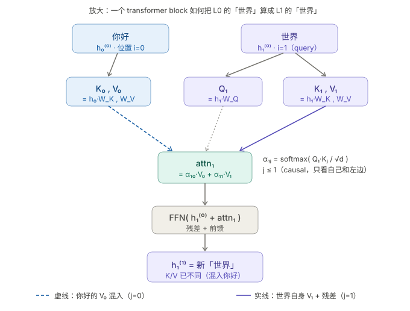

# nano-vllm 学习笔记（一）：Block Manager 与 Prefix Cache

> nano-vllm 是一个极简的 vLLM 复现，核心逻辑只有几百行。正因为足够小，反而是理解 vLLM 调度与 KV cache 管理的好材料。这篇笔记对应 `nanovllm/engine/block_manager.py`，讲清楚 Block 是什么、为什么要有 BlockManager、以及 Prefix Cache 的具体实现。

## Block 是什么

先退一步，从更上游的问题说起：**为什么不直接按 sequence 分配显存？**

LLM inference 的一个特点是序列长度在运行时才知道，而且差异极大——一条请求可能 50 个 token，另一条可能 5000 个。如果按 sequence 预留显存，要么提前分配最大长度（大部分显存空着浪费），要么用动态分配（但连续内存的碎片化问题会让显存利用率越来越低，频繁整理显存又代价极高）。这就是 PagedAttention 要解决的问题：**把显存切成固定大小的 block，像操作系统管理物理内存页一样管理 KV cache**，序列用多少块就分多少块，用完归还，完全按需分配。

Block 的核心职责因此是**持有一段 KV cache**，每个 block 能存 `block_size` 个 token 的 K/V。而固定大小带来一个额外的好处：当两条请求有相同的前缀时，对应的 block 可以共享出去，不必重新计算。这就是 **Prefix Cache**（前缀缓存）。

代码里 `Block` 本身很简单：

```python
class Block:
    def __init__(self, block_id):
        self.block_id = block_id
        self.ref_count = 0
        self.hash = -1
        self.token_ids = []
```

几个字段说一下：
- `block_id`：这个 block 在物理显存里的编号，对应实际的 GPU 内存位置
- `token_ids`：这个 block 里存的 token ID 列表，是用来做 hash 匹配的"索引"，实际的 K/V tensor 存在 GPU 显存的 KV cache 里，用 `block_id` 来定位
- `hash`：这个 block 内容对应的 hash 值（-1 表示"还没算"或者"刚被释放"）
- `ref_count`：有多少个 sequence 在引用这个 block，决定什么时候可以释放

`reset()` 方法会把 `hash` 重置成 -1、清空 `token_ids`、把 `ref_count` 重新设为 1——这是从 free blocks 里拿出一个 block 重新分配给新 sequence 时用的。

## 为什么不同前缀的「世界」KV 不一样

在解释 BlockManager 之前，我想先把一个容易误解的地方讲清楚。

直觉上你可能会想：两条序列 `["你好", "世界"]` 和 `["再见", "世界"]`，它们末尾的 `"世界"` token 是一样的，KV cache 应该可以共享吧？

**不行。** 原因在 attention 的计算过程里。下面这张图展示了一个 transformer block 内部，「世界」token 的 K/V 是怎么被算出来的：



图里的关键信息：「世界」（position i=1）在这个 block 里不只是投影出自己的 K₁/V₁，它的 attention 输出 attn₁ 是 **α₁₀·V₀ + α₁₁·V₁**——「你好」的 V₀（蓝色虚线）和自己的 V₁（紫色实线）按权重混合的结果。经过残差 + FFN 之后，输出的 h₁⁽¹⁾ 已经把「你好」的信息烧进去了。

换成「再见」+ 「世界」，同样位置的 attn₁ 变成了 α·V(再见) + α·V(世界)，混入的是「再见」的 V。所以从第 1 层起，两个序列里「世界」的 hidden state 就开始分叉，每一层的 K/V 都不同。

把这个过程用公式写出来：

$$K_i^{(l)} = h_i^{(l-1)} \cdot W_K^{(l)}$$

权重 $W_K$ 是固定的，但 $h_i^{(l-1)}$（第 $l$ 层的输入 hidden state）不是。它是上一层 attention 的输出：

$$h_i^{(l-1)} = \text{FFN}\!\left(\sum_{j \le i} \alpha_{ij} \cdot V_j^{(l-1)}\right)$$

因为 causal attention 在位置 $i$ 处会对 **0 到 $i$ 所有 position** 做加权求和，`h_i^{(l-1)}` 就把前缀里每个 token 的信息混了进来。结果是：

- **第 0 层**（进入第一个 attention 之前）：`h_i^(0) = embed(token_i) + pos(i)`，只依赖 token 本身和位置，这一层「世界」的 K 在两个序列里确实相同
- **从第 1 层起**：`h_i^(1)` 已经 attend 过左边的「你好」/「再见」，上下文被混入，于是 `K_世界^(1)` 开始分叉；第 2 层、第 3 层污染层层累积，越往上差异越大

KV cache 存的是**每一层**的 K/V。只要有任何一层不同（从第 1 层起必然不同），整块缓存就不能复用。

结论：**KV cache 里的 K/V 依赖从位置 0 到当前位置的整条前缀**。所以 Prefix Cache 的"前缀"必须是完全一致的 token 序列，不是某个词在某条序列里出现过就能复用的。

## BlockManager：管理所有 Block 的生命周期

`BlockManager` 维护着系统里所有 block 的状态。初始化时：

```python
class BlockManager:
    def __init__(self, num_blocks: int, block_size: int):
        self.block_size = block_size
        self.blocks = [Block(i) for i in range(num_blocks)]
        self.hash_to_block_id = dict()
        self.free_block_ids = deque(range(num_blocks))
        self.used_block_ids = set()
```

`free_block_ids` 是一个 deque，所有还没用的 block 都在里面。`hash_to_block_id` 是 Prefix Cache 的核心：一个 hash 到 block_id 的字典，用来查"有没有缓存过这段前缀"。用 hash 而不是直接比较 token_ids，是因为 token_ids 可能很长，直接比较是 O(n)，而 hash 查字典是 O(1)——查询代价和序列长度无关。

`free_block_ids` 用的是 `deque` 而不是 `set`，这不是随手选的。deque 是 FIFO：block 被释放时从右边 append，被重新分配时从左边 popleft。这意味着**最早被释放的 block 最先被复用**，而刚刚释放的 block 在 deque 的末尾，短时间内不会被覆盖。这给了"冷缓存"（hash 还命中但 ref_count 已经是 0 的 block）更长的存活窗口——只要没有新请求把它从 deque 头弹出并覆盖，hash 还有效，下一个相同前缀的请求仍然可以命中它。

### compute_hash：链式哈希，像 cumulative sum 一样

```python
@classmethod
def compute_hash(cls, token_ids: list[int], prefix: int = -1):
    h = xxhash.xxh64()
    if prefix != -1:
        h.update(prefix.to_bytes(8, "little"))
    h.update(np.array(token_ids).tobytes())
    return h.intdigest()
```

这里用的是 **xxhash**（一个极快的非加密哈希算法），但有个关键设计：每个 block 在计算自己的 hash 时，会把**前一个 block 的 hash** 也混进去（`prefix` 参数）。

这就像 cumulative sum：

- Block 0 的 hash = hash(`tokens[0:block_size]`)
- Block 1 的 hash = hash(`hash(block 0)` + `tokens[block_size:2*block_size]`)
- Block 2 的 hash = hash(`hash(block 1)` + `tokens[2*block_size:3*block_size]`)

这样每个 block 的 hash 就**编码了从头到它这个 block 的完整前缀信息**。好处是：如果两条序列前 $k$ 个 block 完全一样，它们的第 $k$ 个 block 的 hash 也完全一样，可以直接命中缓存。

用 -1 作为初始 prefix 值，是为了区分"第一个 block"和"某个中间 block"——如果两条序列的内容碰巧相同，但一个是从某个非零前缀 hash 推导来的，hash 就会不一样，不会被误认为可复用。

当然，hash 存在碰撞的理论可能性。nano-vllm 里还有一层防护：`can_allocate` 里不只比较 hash，还会对比 `block.token_ids` 本身，只有两者都匹配才算真正命中。

### can_allocate：查询能不能放下这个 sequence

`can_allocate` 接受一个 `Sequence`，返回已经缓存了多少个 block（可以直接复用），或者 -1（连 block 都分配不了了）。

```python
def can_allocate(self, seq: Sequence) -> int:
    h = -1
    num_cached_blocks = 0
    num_new_blocks = seq.num_blocks
    for i in range(seq.num_blocks - 1):   # 最后一个 block 不算
        token_ids = seq.block(i)
        h = self.compute_hash(token_ids, h)
        block_id = self.hash_to_block_id.get(h, -1)
        if block_id == -1 or self.blocks[block_id].token_ids != token_ids:
            break
        num_cached_blocks += 1
        if block_id in self.used_block_ids:
            num_new_blocks -= 1
    if len(self.free_block_ids) < num_new_blocks:
        return -1
    return num_cached_blocks
```

几个细节：

**为什么只遍历到 `num_blocks - 1`（跳过最后一个 block）？**
最后一个 block 通常没填满（除非 token 数量恰好是 `block_size` 的整数倍）。一个没填满的 block 还在增长，内容还会变，无法被稳定缓存，所以不参与 prefix cache 的 hash 计算。

**为什么找不到就 break？**
Prefix Cache 的 block 是前缀依赖的——如果第 $k$ 个 block 没有缓存，那么第 $k+1$、$k+2$... 也不可能有缓存（因为后面的 hash 都依赖前面的 hash）。所以一旦断了就可以直接退出。

**`num_new_blocks` 的计算**
如果某个 block 已经在 `used_block_ids` 里（当前正被某个 sequence 使用），它只需要增加 ref_count，不需要从 free_block_ids 里再拿一个新的。所以 `num_new_blocks` 会减去这些。最后检查 `free_block_ids` 是否够用。

### allocate：真正分配 block 给 sequence

```python
def allocate(self, seq: Sequence, num_cached_blocks: int):
    assert not seq.block_table
    h = -1
    for i in range(num_cached_blocks):
        token_ids = seq.block(i)
        h = self.compute_hash(token_ids, h)
        block_id = self.hash_to_block_id[h]
        block = self.blocks[block_id]
        if block_id in self.used_block_ids:
            block.ref_count += 1          # 已被其他 seq 使用，增加引用
        else:
            block.ref_count = 1           # 在 eviction 缓存里，重新激活
            self.free_block_ids.remove(block_id)
            self.used_block_ids.add(block_id)
        seq.block_table.append(block_id)
    for i in range(num_cached_blocks, seq.num_blocks):
        seq.block_table.append(self._allocate_block())   # 新 block
    seq.num_cached_tokens = num_cached_blocks * self.block_size
```

这里做了两件事：
1. 把前 `num_cached_blocks` 个已缓存的 block 拿出来，增加它们的引用计数，然后 append 到 sequence 的 `block_table`
2. 剩下的 block 从 `free_block_ids` 里新分配

有个细节：如果一个 block 的 hash 命中了，但这个 block_id 不在 `used_block_ids` 里（说明它已经被释放成"冷缓存"，还没被新请求覆盖），这时需要把它从 `free_block_ids` 里移出来，重新激活，`ref_count` 设为 1。这就是 nano-vllm 里 Prefix Cache eviction 的工作方式：block 被释放时先待在 free_block_ids 的末尾，只要还没被新请求覆盖，就还能被 hash 命中复用。

### deallocate：释放 sequence 的 block

```python
def deallocate(self, seq: Sequence):
    for block_id in reversed(seq.block_table):
        block = self.blocks[block_id]
        block.ref_count -= 1
        if block.ref_count == 0:
            self._deallocate_block(block_id)
    seq.num_cached_tokens = 0
    seq.block_table.clear()
```

这就是引用计数的垃圾回收：每个 block 被多少 sequence 用着，就有多少 ref_count。只有当 ref_count 减到 0，这个 block 才真的放回 `free_block_ids`。**从后往前释放**是有意为之的——如果有其他 sequence 共享前缀，前面的 block ref_count > 1 不会被释放，而当前 sequence 独有的后段 block 会最先释放。

### 剩下三个 method：append 和 hash_blocks

用户笔记里没有覆盖到的三个方法补充一下：

**`can_append`**：在 decode 阶段，每次新 token 进来都可能需要扩展一个新 block。这个方法检查现在还有没有空闲 block 可用：

```python
def can_append(self, seq: Sequence) -> bool:
    return len(self.free_block_ids) >= (len(seq) % self.block_size == 1)
```

`len(seq) % self.block_size == 1` 这个条件的含义是：当前 token 数对 block_size 取模余 1，说明刚刚开始填一个新 block（之前那个刚好被填满了），此时需要从 free_block_ids 里拿一个新 block，所以判断 `free_block_ids` 是否至少有 1 个。否则不需要新 block，直接返回 True。

**`may_append`**：实际执行扩展 block 的操作，和 `can_append` 的条件对应：

```python
def may_append(self, seq: Sequence):
    if len(seq) % self.block_size == 1:
        seq.block_table.append(self._allocate_block())
```

**`hash_blocks`**：这个方法在每次推理完成后（postprocess 阶段）被调用，把这轮刚刚完成 prefill 的 block 写入 hash 索引，让后续请求可以命中这段缓存：

```python
def hash_blocks(self, seq: Sequence):
    start = seq.num_cached_tokens // self.block_size
    end = (seq.num_cached_tokens + seq.num_scheduled_tokens) // self.block_size
    if start == end: return
    h = self.blocks[seq.block_table[start - 1]].hash if start > 0 else -1
    for i in range(start, end):
        block = self.blocks[seq.block_table[i]]
        token_ids = seq.block(i)
        h = self.compute_hash(token_ids, h)
        block.update(h, token_ids)
        self.hash_to_block_id[h] = block.block_id
```

这里只处理 `start` 到 `end`（这轮新完成的 block），从上一个 block 的 hash 开始续接链式计算，确保新 block 的 hash 正确编码了完整前缀信息。

## 小结

Block Manager 的设计逻辑一句话就可以说清楚：**用链式 hash 给每段前缀打标识，然后用引用计数管理 block 的生命周期**。`can_allocate` 负责查询，`allocate` 负责绑定，`deallocate` 负责释放，`hash_blocks` 负责更新索引，`can_append` / `may_append` 负责 decode 阶段的动态扩展。

下一篇会讲 Sequence 对象和 Scheduler 的调度逻辑。
