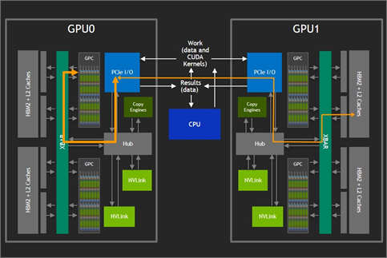
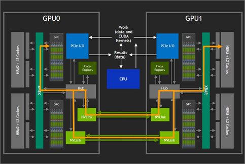
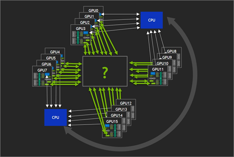
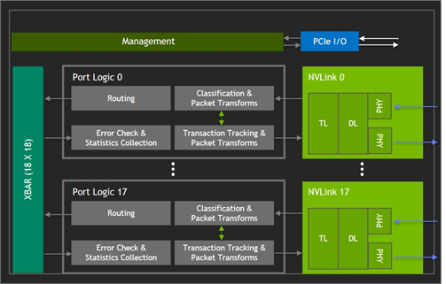
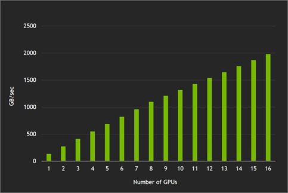
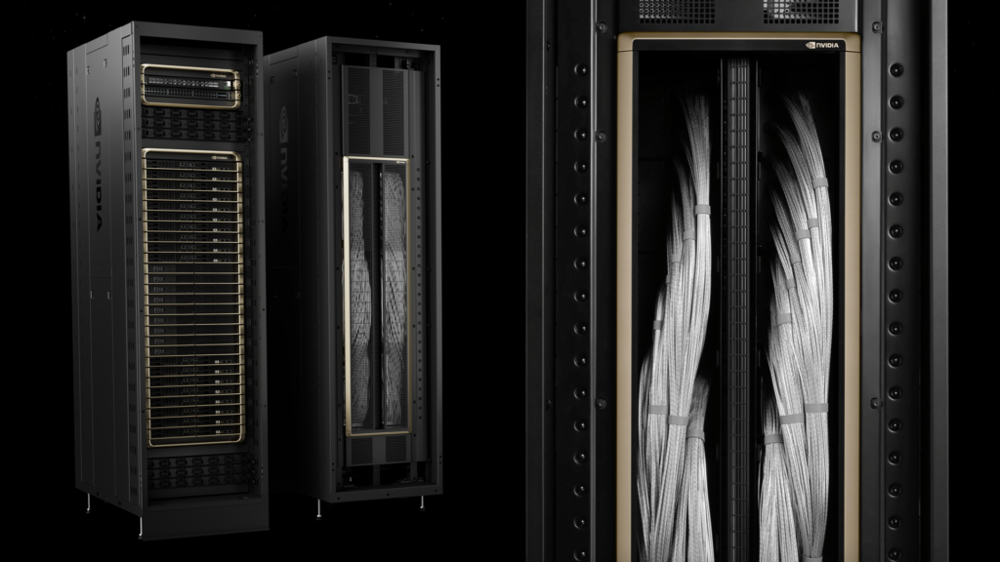

# NVIDIA GPU 是怎么互联的？从 NVSwitch 到 NVL72 的拓扑演进

> 当我们说"用 8 卡 / 16 卡 / 72 卡训练一个大模型"时，这些 GPU 之间到底是**怎么连起来的**？为什么不能简单地用 PCIe？为什么 NVIDIA 要专门做一颗叫 NVSwitch 的交换芯片？从 2018 年的 DGX-2 到 2026 年的 Vera Rubin，互联方式经历了几次质变，而每一次改动背后都有非常清晰的工程动机和取舍。这篇笔记把这条线串起来。

## 为什么 PCIe 不够用？

多 GPU 训练能做到近线性的性能扩展，前提是 GPU 之间能**快速交换数据**。但传统的 PCIe 总线有两个硬伤：

- **带宽太低**：PCIe Gen5 单向约 64 GB/s，而早期 NVLink 就已经是它的 ~10 倍；到 Blackwell 一代，NVLink 5 已经是 PCIe Gen5 的 **14 倍**。
- **拓扑是树状共享**：多张卡挂在同一组 PCIe Switch / Root Complex 下，互相通信要绕道 CPU 或上游交换节点，在"all-to-all"场景下极易撞车。

下图是两颗 GPU 通过 PCIe 通信的路径——数据要先经过各自的 PCIe I/O，再走 CPU 这个共享枢纽中转，CPU 和 PCIe 链路同时成了带宽瓶颈：

于是 NVIDIA 在 Pascal 时代引入了 **NVLink**——一条 GPU 到 GPU 的私有高速点对点链路，把数据通路从"绕道 CPU"改成"两卡直连"：

但只有 NVLink 还不够，因为点对点直连有个天花板，下面会讲到。

## 互联的两个主角：NVLink 与 NVSwitch

理解 NVIDIA 的互联，先分清两个东西：

| 名称 | 是什么 | 作用 |
| --- | --- | --- |
| **NVLink** | GPU 上的一组高速串行链路（SerDes） | 提供 GPU↔GPU 的物理通道 |
| **NVSwitch** | 一颗独立的交换芯片 | 把多条 NVLink 汇聚交换，实现全互联 |

打个比方：NVLink 是每颗 GPU 伸出来的"网线"，NVSwitch 是把这些网线插在一起的"交换机"。

### 为什么只有 NVLink 直连不行？

第一代多卡方案（DGX-1）用 NVLink 把 8 颗 GPU 直连成一张"hybrid cube mesh"网格。问题在于：每颗 GPU 的 NVLink 数量有限，无法和其余每一颗都建立直连。于是在 **all-to-all**（每颗卡都要和其他每颗卡通信）的场景下，某些 GPU 对之间没有直达链路，只能退回走慢得多的 PCIe 路径——成了瓶颈。

下面这张图很直观地表达了这个困境：当 16 颗 GPU 都想和彼此通信时，中间那个"?"就是缺失的那一层——一个能让任意两颗卡满速直达的交换层。

要让"任意两颗 GPU 都能满速直达"，并且扩展到 8 卡以上，就需要一个**交换层**。这就是 NVSwitch 登场的原因。

## NVSwitch 是什么：一个无阻塞的 18×18 交叉开关

以第一代 NVSwitch（Volta / DGX-2，2018）为例，它是一颗 20 亿晶体管的独立芯片，物理上由一圈 NVLink PHY、对应的 Port Logic 和中央的 XBAR 交叉开关构成：

它的核心规格：

| 规格 | 数值 |
| --- | --- |
| 端口数 | 18 个 NVLink 端口 |
| 内部结构 | 18×18 全连接 crossbar（交叉开关） |
| 单端口带宽 | 50 GB/s 双向（25 GB/s × 2 方向） |
| 单芯片聚合带宽 | 900 GB/s |
| 晶体管 | 20 亿 |

下面是它的功能框图：18 个 NVLink 端口各自配一套 Port Logic（负责路由、分类、差错校验与统计），中央是一块 18×18 的 XBAR，再加上 Management 与 PCIe I/O 用于管理面：

::: tip 核心概念：非阻塞（non-blocking）
crossbar 是"非阻塞"的——任意入端口都能以满速打到任意出端口，多对端口同时满速通信也不会互相挤占。这是它能"假装成一颗大 GPU"的物理基础。
:::

数据完整性方面，NVSwitch 做了分层防护，这点对生产环境很关键：

- **NVLink 链路层**：用 CRC 检错 + 自动重传。
- **NVSwitch 内部**：数据通路、路由表、状态结构用 ECC 保护，外加末跳地址校验和缓冲区上/下溢检查。
- **安全隔离**：路由表由 **Fabric Manager** 统一索引和管理，限制每个应用只能访问自己的地址范围——本质是在交换 fabric 层做多租户隔离。

## 拓扑结构：以 DGX-2（16 卡）为例

DGX-2 是理解这套拓扑的最佳样本。它的物理结构是：

- **2 块 GPU 基板（baseboard）**，每块基板上焊着 **8 颗 V100 + 6 颗 NVSwitch**。
- 全机共 **16 颗 GPU + 12 颗 NVSwitch**。

连接方式是整套设计的精髓：

from https://developer.nvidia.com/blog/hgx-2-fuses-ai-computing/ 

from: https://images.nvidia.com/content/pdf/nvswitch-technical-overview.pdf

关键点拆开说：

1. **每颗 V100 有 6 条 NVLink**，这 6 条**分别**接到本基板的 6 颗 NVSwitch 上——一颗交换机吃掉每颗 GPU 的 1 条。
2. **每颗 NVSwitch 的 18 个端口**这样分配：8 个连本板的 8 颗 GPU，8 个连对端基板对应的那颗 NVSwitch，**剩 2 个保留**。
3. 上下两行编号相同的 Sw（如两个 Sw1）是**两颗独立的物理芯片**（分处两块板），它们配对、用 8 条 NVLink 互联。

::: tip 关键区别：跳数 ≠ 芯片数
"6 条 NVLink 聚合 300 GB/s、单跳到达"指的是**跳数**，不是只用一颗芯片。GPU A 发给同板 GPU B 时，流量被**拆成 6 份、并行走 6 颗交换机**（每颗 50 GB/s，合计 300 GB/s），而每一份数据**只穿过 1 颗交换机**（1 跳）。一句话："6 颗芯片同时用，但每个包只过其中一颗。"
:::

由此得到两条带宽结论：

- **同板 GPU 互通**：单跳，满带宽 300 GB/s。
- **跨板 GPU 互通**：两跳（本板交换机 → 对端交换机），带宽仍满 300 GB/s。
- **两板间对剖带宽（bisection）**：6 颗交换机 × 8 条跨板链路 = 48 条，48 × 25 GB/s（单向）× 2 = **2.4 TB/s**。

这套全互联拓扑带来的直接收益，是带宽随 GPU 数量近线性增长。下图是 DGX-2 上 all-reduce 的实测：从 1 卡到 16 卡，聚合带宽几乎是一条直线往上爬——这正是"16 卡当一颗 GPU 用"在性能上的体现：

## 为什么要这样互联？

### 数字"6"和"12"不是拍脑袋定的

整个布局是被两个硬约束逼出来的：

$$\text{每板交换机数} = \frac{\text{每颗 GPU 的 NVLink 数}}{1} = 6, \qquad \text{每颗交换机占用端口} = \text{每板 GPU 数} = 8$$

- 每颗 GPU 出 **6 条** NVLink → 需要 **6 颗**交换机来分别承接（每颗接一条）。
- 每颗交换机要接住本板 8 颗 GPU 各 1 条 → 用掉 **8 个端口**。
- 板内 NVLink 总数 8 × 6 = 48 条 = 6 颗交换机 × 8 端口，账正好对上。

::: tip 核心洞察
**"6" = GPU 的 NVLink 条数，"18" = 交换机的端口上限。** 整套拓扑就是这两个数字的几何后果，不是自由设计的结果。
:::

### 为什么"摊成多颗"而不是"一颗大芯片"

- **端口物理上限**：一颗芯片只有 18 个端口，受限于裸片边缘能排布的 SerDes 数量、封装引脚和功耗。想用一颗芯片接 16 卡 × 6 条 = 96 条链路，做不到。
- **把带宽摊开才能无阻塞**：一颗 GPU 的 6 条链路分散到 6 颗交换机，意味着任意两卡间流量天然走 6 条并行路径，不会在单颗芯片上挤成瓶颈。
- **容错**：单颗交换机故障是"降级"而非"全断"。

全互联（all-to-all NVLink fabric）相比上一代的 hybrid cube mesh 直连，优势在带宽敏感的负载上立竿见影。下图对比了半台 DGX-2（绿，全互联）和 DGX-1（蓝，hybrid cube mesh）在 cuFFT 上的扩展性——直连方案在 4 卡后就因为"凑不齐直达链路"而严重掉速，全互联则稳定线性增长：

### 为什么死磕"跨板带宽"

DGX-2 的核心卖点是"**16 卡当一颗 GPU 用、拓扑对程序员透明**"。这个抽象成立的前提是**不管挑哪两颗卡通信，带宽都一样满**。如果跨板慢一截，就变成 NUMA 式的"非均匀带宽"，程序员被迫关心"我这两颗卡在不在同一块板"，抽象就破了。而且集合通信（如 all-reduce）的速度被**最慢的那条链路**卡住，所以最易成为短板的跨板路径必须做满。

## NVLink 和 InfiniBand 是什么关系？

很多人会混淆这两者，其实它们是**互补的两层网络**：

| | NVLink / NVSwitch | InfiniBand / RoCE 以太网 |
| --- | --- | --- |
| 定位 | **Scale-up**（纵向，节点/机架内） | **Scale-out**（横向，节点间） |
| 带宽量级 | TB/s | 几十 GB/s（低一个数量级以上） |
| 协议 | NVIDIA 私有 | 开放标准 |
| 目的 | 一小撮 GPU 紧耦合成"一颗大 GPU" | 把很多节点拼成大集群 |

下图直观地拉开了两者的差距：同样做 all-to-all，DGX-2 内部的 NVLink fabric（绿）相比两台 DGX-1 走 4×100Gb InfiniBand（蓝），小消息快约 **8×**、大消息也快约 **3×**：

一句话：**NVLink 管箱子里面，InfiniBand 管箱子之间。** 一个大模型训练任务，通常节点内用 NVLink 做对带宽极敏感的 Tensor Parallelism，节点之间用 IB 做 Data / Pipeline Parallelism，两者叠加。

## 历代互联演进：从 16 卡到 72 卡

这是本文的重点。把五代架构放在一起对比，演进主线一目了然：

| 代际 | GPU | NVLink | 每 GPU 链路数 | 单链路带宽(双向) | 每 GPU 总带宽 | NVSwitch | NVLink 域规模 |
| --- | --- | --- | --- | --- | --- | --- | --- |
| Volta (2018) | V100 | 2.0 | 6 | 50 GB/s | 300 GB/s | gen1, 18 端口 | 16 卡 / 节点 |
| Ampere (2020) | A100 | 3.0 | 12 | 50 GB/s | 600 GB/s | gen2 | 8 卡 / 节点 |
| Hopper (2022) | H100 | 4.0 | 18 | 50 GB/s | 900 GB/s | gen3, 64 端口 | 8 卡 / 节点 |
| Blackwell (2024–25) | B200 / GB200 | 5.0 | 18 | 100 GB/s | 1.8 TB/s | gen4, 72 端口 | **72 卡 / 机架** |
| Rubin (2026) | Rubin | 6.0 | ~18 | ~200 GB/s | ~3.6 TB/s | switch tray | 72 封装 / 机架 (NVL144) |

从这张表能读出三条不同性质的演进。

### 演进一：每 GPU 带宽几乎每代翻倍，但实现方式中途换打法

从 V100 到 H100（300 → 600 → 900 GB/s），靠的全是**加链路数**（6 → 12 → 18），单链路带宽一直是 50 GB/s 没动。到 **18 这个数字就触顶了**（受裸片边缘 SerDes 和功耗约束），之后 Blackwell、Rubin 链路数不再增加，改成**翻单链路带宽**：

- NVLink 5（Blackwell）把每 lane 速率翻倍到 200 Gbps，单端口 100 GB/s 双向，18 端口 = 1.8 TB/s。
- NVLink 6（Rubin）再翻一倍到每 GPU ~3.6 TB/s。

::: tip 工程逻辑
固定 18 端口、每代翻倍单链路带宽——这样交换机的 18×18 端口架构能跨代复用，生态更稳定，代价转移到了对 SerDes 调制（PAM4、更高 Gbps/lane）和封装的要求上。
:::

### 演进二：单颗交换机越做越大，数量反而变少

DGX-2 时代每板要 6 颗交换机接 8 卡；到 Hopper，每台 HGX H100 只用 **4 颗**第三代 NVSwitch 就为 8 卡提供 3.6 TB/s 双向带宽，因为单颗交换机端口数大幅提升（gen3 之后达 64~72 端口）。分母变大，需要的芯片就少了。

第三代 NVSwitch 还引入了 **SHARP（网络内计算）**：交换机能直接在网络里对多颗 GPU 的数据做聚合，不必每次都往返到各 GPU。这意味着 **all-reduce 的求和可以卸载到交换机里做**，对带宽密集的集合通信是实打实的提速——从 Volta 的"哑交换"到现在的"智能 fabric"是一次质变。

### 演进三：最大的范式转变——NVSwitch 搬出服务器，进了机架

这是和"拓扑"最相关的一次改动。

- **Volta~Hopper**：NVSwitch 焊在 GPU 基板上，NVLink 域被困在一个节点里（≤16 卡）。
- **Blackwell**：NVSwitch 做成独立的 **switch tray** 装进机架。NVL72 用 9 个 switch tray（每个 2 颗 ASIC，共 18 颗）、5184 根无源铜缆，把 **72 颗 GPU** 做成机架内全互联，130 TB/s 聚合带宽，整机架像一颗逻辑大 GPU，还能在 fabric 里进一步扩到 576 卡。

下图就是 GB200 NVL72 整机架：中间那条垂直的"脊柱"就是 NVLink switch tray + 铜缆背板，把上下两摞共 18 个 compute tray 里的 72 颗 GPU 全互联起来：

::: tip 核心洞察
"把 N 颗 GPU 当成一颗用"这个理念从未改变，变的只是 **N**：从 DGX-2 的 16（一个节点）跳到 NVL72 的 72（一个机架）。NVLink 域越大，能塞进"全速互联区"的 TP / EP 规模就越大，原本必须跨 IB 的通信可以留在 NVLink 里。
:::

### 关于 Rubin（最新一代）

Rubin 仍在落地中，几个细节值得注意：命名上 NVIDIA 改用"按 die 计数"的新口径，NVL144 和 NVL72 其实都是 72 个 GPU 封装，NVL144 是按裸片数命名；Rubin 的 switch tray 用 4 颗 NVLink ASIC（NVL72 是 2 颗）靠翻倍 ASIC 来翻倍带宽；同时为向后兼容 Blackwell 的 Oberon 机架，**复用了那套 5184 根无源铜缆背板**。不同来源对它叫 NVLink 6 还是 7 仍有出入，相关数字当作"接近定稿但可能微调"来看。

## 这些改动是为了什么？又付出了哪些代价（Trade-off）？

每一次互联升级都不是免费的午餐。把权衡列清楚：

| 改动 | 目的 | 代价 / Trade-off |
| --- | --- | --- |
| NVLink 取代 PCIe | 更高带宽 + 点对点拓扑 | 私有协议，厂商锁定；只有专门设计的服务器（DGX/HGX）才有 |
| 引入 NVSwitch | 突破点对点直连上限，做全互联 | 额外的芯片成本、功耗、板级复杂度 |
| 拆成多颗交换机 | 无阻塞 + 容错 + 绕开端口上限 | 走线、供电、散热复杂；板级面积占用 |
| 每代翻链路带宽 | 在固定 18 端口下继续提带宽 | SerDes 功耗飙升，必须上液冷；对封装和信号完整性要求极高 |
| 交换机搬进机架 (NVL72) | 把 NVLink 域从 16 扩到 72+ | 机架级液冷、~120kW 功耗、单机架成本数百万美元；故障域（blast radius）变大 |
| 坚持无源铜缆背板 | 低功耗、低成本、高可靠、零光模块 | 距离受限（铜缆只能在机架尺度内用），限制了单 NVLink 域的物理半径 |

几个值得展开的权衡：

::: tip 铜 vs 光
NVL72/NVL144 坚持用**无源铜缆**而非光互联——铜不耗电、便宜、可靠，但传输距离短。这就把 NVLink 域的物理上限锁在了"一个机架"的尺度。要再往上扩（跨机架），就得回到 InfiniBand / 光这条 scale-out 路径。**铜的物理极限，某种程度上定义了"一颗逻辑 GPU"能有多大。**
:::

::: tip Scale-up vs Scale-out 的根本取舍
NVLink（scale-up）带宽高但贵、域有限；IB / 以太网（scale-out）便宜、可无限扩但慢一个数量级。把更多 GPU 塞进 NVLink 域能减少跨 IB 的慢速通信，但 NVLink 域每扩大一倍，成本、功耗、故障域都跟着放大。这就是为什么不是所有 GPU 都用 NVLink 连——**只有对通信最敏感的那部分并行（TP / EP）才值得占用昂贵的 NVLink 带宽。**
:::

## 实际工程中的考量

::: warning 选并行方式时如何对应到拓扑
- **Tensor Parallelism**：每层多次 all-reduce、在关键路径上，对带宽和延迟都极敏感 → 必须关在 NVLink 域内（TP degree 一般 ≤ 单节点/单机架 GPU 数）。
- **Pipeline Parallelism**：只在 stage 边界传少量激活值，对带宽不敏感 → 适合跨 IB。
- **Data Parallelism**：每步一次梯度 all-reduce，开销可被计算掩盖 → 放最外层、容忍较慢的跨节点链路。
- **Expert Parallelism (MoE)**：dispatch + combine 是两次 all-to-all，最吃带宽 → 尽量留在 NVLink 域内。
:::

把这套对应关系记住，再看 NVIDIA 的拓扑演进，就会发现**互联的每一次升级，本质都是在为"把更敏感的并行方式塞进更大的全速域"服务。** 这一点在真实负载上也能看到回报——下图是 DGX-2 全互联 fabric 在 HPC 与 AI 训练上相对上一代的加速，最吃 all-to-all 的 MoE 语言模型提升最明显（2.7×）：

## 总结

| 问题 | 答案 |
| --- | --- |
| GPU 之间通过什么互联？ | GPU 上的 NVLink 链路 + 独立的 NVSwitch 交换芯片 |
| 拓扑是什么样的？ | 每颗 GPU 的 N 条 NVLink 分散接到 N 颗交换机；交换机内部是无阻塞 crossbar |
| 为什么不用 PCIe？ | 带宽低一个数量级，且树状共享拓扑在 all-to-all 下撞车 |
| 为什么死磕跨板/跨机架带宽？ | 要让"N 卡当一颗 GPU"的抽象成立，任意两卡带宽必须均匀且满 |
| 历代怎么演进的？ | 先加链路数（6→12→18），再翻单链路带宽（50→100→200 GB/s）；交换机越做越大、越来越少；最后搬出节点进机架 |
| 改动目的是什么？ | 把 NVLink 全速域从 16 卡扩到 72+ 卡，让更敏感的并行（TP/EP）能留在 scale-up 域内 |
| 主要 trade-off？ | 带宽 ↔ 功耗/散热/成本；铜缆可靠 ↔ 距离受限；scale-up 快但域小贵 ↔ scale-out 便宜但慢 |

NVLink / NVSwitch 这条线最迷人的地方在于：**约束几乎没变**（GPU 链路数、交换机端口数、铜缆物理半径这几个硬上限始终在主导设计），但 NVIDIA 通过"加链路 → 翻链路带宽""把交换机做大做少""把交换机搬进机架"几招，硬是把"当成一颗 GPU 用"的边界从 16 卡推到了 72 卡乃至更大。下一篇可以接着算：在 NVL72 这套 72 卡 NVLink 域 + 跨机架 IB 上，一个具体的 MoE 模型该怎么映射 TP / EP / PP。

---

> **图片来源**：本文配图均来自 NVIDIA 官方技术博客与白皮书，包括 [NVSwitch Accelerates NVIDIA DGX-2](https://developer.nvidia.com/blog/nvswitch-accelerates-nvidia-dgx2/)、[NVSwitch Technical Overview](https://images.nvidia.com/content/pdf/nvswitch-technical-overview.pdf) 与 [GB200 NVL72](https://developer.nvidia.com/blog/nvidia-gb200-nvl72-delivers-trillion-parameter-llm-training-and-real-time-inference/)，版权归 NVIDIA 所有，此处仅作技术学习引用。
