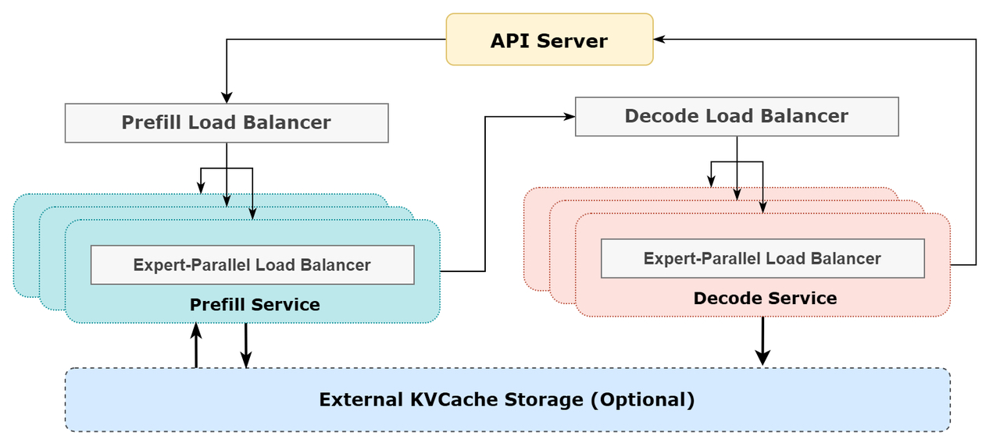
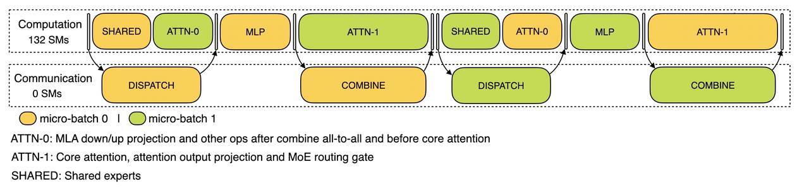
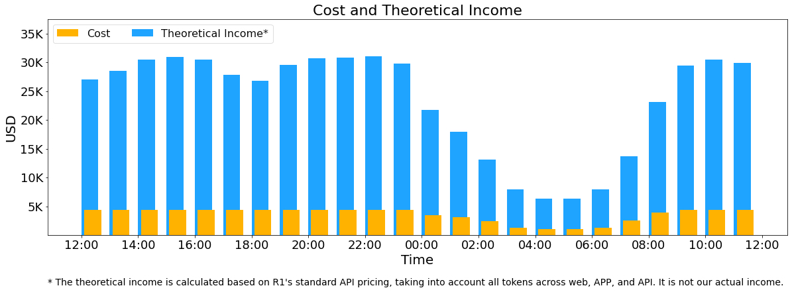
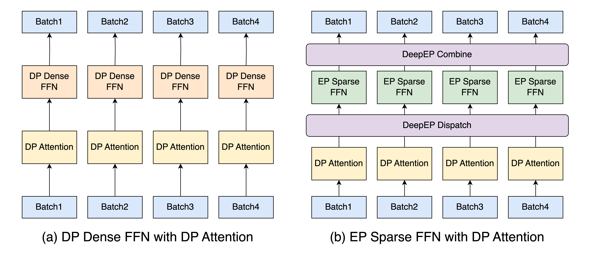

# 大模型是怎么"摊"到上千张卡上的：并行策略、通信原语与 DeepSeek / Kimi K2 真实部署拆解

> DeepSeek-V3 有 671B 参数，Kimi K2 有 1T 参数。一张 H100 只有 80GB 显存——光是 FP8 权重就要 600GB 以上，再加上 KV Cache、激活、通信缓冲，**一张卡、甚至一台 8 卡机器都装不下**。
>
> 于是问题来了：怎么把一个模型"摊"到几十、上百张 GPU 上，让它们协同算出和单卡一样的结果，同时还要跑得够快、够便宜？这就是**并行（parallelism）**要解决的问题。本文先讲清楚为什么能并行、有哪几种并行、各自受什么约束，再用 DeepSeek 和 Kimi K2 的**真实生产部署方案**把这些拼到一起。

## 一切的起点：为什么能"切开"算？

把模型摊开的前提，是 Transformer 的计算本身具有**结构性的可分性**。不是所有计算都能随便拆，但大模型的几个主要部件恰好都能沿某个维度切开：

- **矩阵乘法可以分块**：`Y = X·W`，把 `W` 按列切成 `[W1 | W2]`，那么 `Y = [X·W1 | X·W2]`——两块可以在不同卡上独立算，最后拼起来。这是**张量并行**的数学基础。
- **样本之间相互独立**：一个 batch 里的不同样本互不影响，loss 对 batch 可加。把 batch 拆成几份各算各的，最后把梯度加起来即可。这是**数据并行**的基础。
- **层是顺序依赖、但可以流水**：第 `L` 层的输入是第 `L-1` 层的输出，没法同时算；但可以把不同层放到不同卡上，让多个 micro-batch 像工厂流水线一样依次穿过。这是**流水线并行**的基础。
- **MoE 的专家相互独立**：Mixture-of-Experts 里，每个 token 只激活少数几个专家，专家之间没有依赖。把不同专家放到不同卡上，按需把 token 送过去算即可。这是**专家并行**的基础。

可分性带来的代价是**通信**：切开之后，每张卡只持有一部分数据或一部分结果，必须在某些点上把它们交换、合并。**并行的全部工程难度，几乎都集中在"如何让通信不拖慢计算"上。**

## 四种并行：同一个模型，四种"摊开"方式

先用一张可交互的图建立直觉。同一个 Transformer 放到 4 张 GPU 上，切换并行方式，看每张卡**到底持有模型的哪一部分、跑的是哪一份数据、卡之间要做什么通信**（动画会自动在四种方式间轮播，也可以点 tab 手动切换）：

<HtmlVisualization
  src="/machine-learning/inference/visualizations/parallelism-split-explorer.html"
  height="640px"
  title="交互可视化：一个模型，四种摊开方式（DP / TP / PP / EP）"
/>

下面逐一展开。

### 数据并行 DP：复制模型，切分数据

**做法**：每张卡持有**一份完整的模型副本**，但各自处理 batch 的不同分片。

**为什么能并行**：样本独立、loss 可加。GPU 0 算 batch 的前 1/4，GPU 1 算第二个 1/4……各自独立前向、反向。

**通信约束**：训练时，反向传播得到的梯度必须做一次 **All-Reduce** 求平均，让四份副本的参数始终保持一致；纯推理时则退化为多个独立副本，副本之间无需通信，是最简单的扩容方式。

**最大的限制**：每张卡都要装下**完整模型**。对 671B / 1T 的模型这显然不可能——所以纯 DP 根本用不上大模型，必须叠加下面三种并行，或者用 ZeRO / FSDP（见下）。

#### DP 到底能不能加速推理？

这是一个容易混淆的点，关键是把**训练**和**推理**分开看，并区分**吞吐**和**延迟**：

- **训练**：训练的本质就是"把海量数据反复喂给模型、不断更新权重"，所以**训练快不快，约等于单位时间能消化多少数据**。一张卡一步只能处理一个 batch；用 N 张卡做 DP，这 N 张卡在**同一步里各自处理一个不同的 batch**，一步就吃掉了 N 个 batch 的数据。而每一步的墙上时间几乎不变（N 张卡是**并行**地各做一个 batch 的前向+反向），于是看完整个数据集所需的**步数降到 1/N**，训练墙上时间也近似降到 1/N——这就是提速。步末的那次梯度 All-Reduce，把这 N 份并行更新合并成一次等效的"大 batch 更新"，保证数学上和"单卡跑一个 N 倍大的 batch"等价。注意：每张卡拿到的是 batch 的**一个分片**，不是"满的 batch"。
- **推理**里没有反向、没有梯度同步，DP 就退化成 **N 个互相独立的模型副本**，每个副本服务不同的请求流。它提升的是**整体吞吐**（QPS、能同时服务的并发用户数），**但不会降低单条请求的延迟**——一条请求仍然在一张卡上以原来的速度跑完。

> **一句话区分**：训练的目标是"消化更多数据"，所以"一步吃 N 个 batch"= 直接提速；推理的目标是"把一个请求尽快算完"，多加副本只是让你能**同时**服务更多请求，单个请求的计算量没变、还在一张卡上跑，所以延迟不变。这就是 DP 对训练是"提速"、对推理只是"扩容"的根本区别。

所以结论是：**DP 对推理一样有用**，它是把一个"装得下"的模型横向扩容、扛更多并发的最简单办法；它只是不解决"单卡装不下大模型"和"单请求要更快"这两件事。前者交给 TP / PP / EP，后者主要靠 TP（把一层的计算摊到多卡并行，缩短单步时间）。

#### 顺带说清 ZeRO / FSDP

标准 DP 的浪费在于：参数、梯度、优化器状态在**每张卡上各存一份**，完全冗余。**ZeRO（DeepSpeed）/ FSDP（PyTorch 的 Fully Sharded Data Parallel）**就是把这份冗余消掉——它们沿 DP 维度把这三样东西切开，每张卡只存 `1/N`：

- ZeRO-1 切优化器状态，ZeRO-2 再切梯度，**ZeRO-3 / FSDP 连参数本身也切**；
- 真正要用某一层时，临时用 **All-Gather** 把这一层的完整参数从各卡拼回来，算完**立刻释放**；反向得到的梯度则用 **Reduce-Scatter** 散回各自负责的分片。

这样每卡显存占用近似降到 `1/N`，既保留了 DP "写起来简单、扩展性好"的优点，又能训练单卡放不下的模型，代价是多了 All-Gather / Reduce-Scatter 的通信。优化器状态和梯度是训练独有的，所以 ZeRO / FSDP 主要服务训练；但"参数分片、用时再聚合"这个思路，在超大模型的推理里也会被借用。

#### "把注意力按请求做数据并行"是什么意思？

这是 DeepSeek / Kimi K2 的一个关键取舍，值得单独讲清。它说的是：MoE 模型里，**注意力部分用 DP、专家部分用 EP**。为什么注意力偏偏要用 DP？看一下用 TP 会怎样：

- 普通多头注意力（MHA）用 TP 时按 head 切，每张卡只存自己那几个 head 的 KV，KV Cache 是被**切开**的、不重复——这没问题。
- 但 DeepSeek / Kimi 用的是 **MLA（Multi-head Latent Attention）**：它把所有 head 的 KV **压成一个共享的低秩潜向量**。这个潜向量没法像 MHA 那样按 head 干净地切——一旦对 MLA 做 TP，每张卡都得存**整份**潜 KV，于是 KV Cache 在整个 TP 组里被**复制了 N 份**，白白浪费本就紧张的显存。
- **DP Attention 的解法**：注意力不按 head 切，而是**按请求切**——每张卡完整负责一部分请求的注意力，**这部分请求的 KV Cache 只存在这一张卡上，全程不重复**。等数据流到 MoE 层，再用 All-to-All 把 token 派发到专家所在的卡。

> **顺便补一句 MLA 是什么。** 标准多头注意力（MHA）要为**每个 head、每个 token** 各缓存一份 K 和 V，KV Cache 随上下文长度线性膨胀，是长上下文推理最大的显存开销之一。**MLA（Multi-head Latent Attention）**的思路是：不直接缓存每个 head 的 K/V，而是先把它们**联合压缩成一个低秩的"潜向量"（latent）**，只缓存这个小向量；真正算注意力时，再用一个上投影矩阵**临时把各 head 的 K/V 还原出来**。结果是 KV Cache 能压到原来的几十分之一（DeepSeek 称约为同规模 MHA 的 1/N），代价是多一点投影计算。而正因为被缓存的是"head 间共享的潜向量"、无法按 head 切，注意力才只能走 DP。MLA 的完整推导见 [DeepSeek-V3 技术报告](https://arxiv.org/html/2412.19437v1)。

一句话：**注意力 DP（让 MLA 的 KV Cache 不重复）+ MoE EP（让专家摊得开）**，把最重的通信只留给 MoE 的 All-to-All——这正是后面 DeepSeek 部署方案的核心思路。

> 小结：DP 解决"吞吐扩容"，ZeRO / FSDP 让 DP 也能装下大模型，DP Attention 让 MLA 的 KV Cache 不被复制。但"单卡装不下、单步要更快"这件事，最终还要靠下面三种并行。

### 张量并行 TP：把每一层的权重矩阵切片

**做法**：把**每一层**的权重矩阵切片，分散到多张卡上。Megatron-LM 的经典切法是——注意力按 head 切（GPU 0 算 head 0–7，GPU 1 算 head 8–15……），FFN 的两个线性层一个按列切、一个按行切。每张卡只持有 1/N 的权重，处理的是**同一个 batch**。

**为什么能并行**：就是开头那个矩阵分块。`X·[W1|W2] = [X·W1 | X·W2]`，每张卡算一块部分结果。

**通信约束**：这是 TP 的关键。每个 Attention 块和每个 FFN 块算完，各卡手里只是**部分和**，必须做一次 **All-Reduce** 才能拼成完整激活喂给下一层。也就是说，**前向每层一次、反向每层一次 All-Reduce**，通信极其频繁，而且死死卡在计算的关键路径上——算一点、同步一次、再算一点。

**最大的限制**：正因为通信量大且在关键路径上，TP **只能在高带宽互联域内做**。在传统 8 卡机器里，TP 度通常 ≤ 8，因为跨出 NVLink、走 InfiniBand 之后 All-Reduce 会慢到无法接受。（这也是为什么 NVLink / NVSwitch 拓扑如此重要——参见[《GPU 是怎么互联的：从 NVSwitch 到 NVL72》](./nvlink-nvswitch-topology)。NVL72 把 NVLink 域扩到 72 卡，正是为了让大 TP / EP 成为可能。）

### 流水线并行 PP：把模型沿深度切成阶段

**做法**：把模型的**连续若干层**分给一张卡。GPU 0 拿层 0–2，GPU 1 拿层 3–5，依此类推。一个输入要依次穿过所有阶段才算完。

**为什么能并行**：层虽然顺序依赖，但可以沿深度切成"阶段"，再把 batch 拆成多个 **micro-batch**，让它们像流水线一样错峰穿过——当 micro-batch 1 在阶段 2 时，micro-batch 2 正好可以进阶段 1。

**通信约束**：只需要在**相邻阶段之间**用 **P2P（点对点）Send/Recv** 传一份激活。通信量远小于 TP 和 DP——这是 PP 的最大优点，因此它常被用来**跨节点、跨越 NVLink 域**连接多台机器。

**最大的限制**：**流水线气泡（bubble）**。流水线刚启动和快结束时，总有些阶段在空转等待。micro-batch 越多，气泡占比越小，但 micro-batch 一多，每个阶段要同时保存的中间激活就越多，显存压力上升。气泡和显存之间的权衡，是 PP 调参的核心。

### 专家并行 EP：把 MoE 的专家分散到不同卡

**做法**：这是 MoE 大模型专属的维度。注意力部分用复制 / DP，但 **MoE 的专家**分散到不同卡——GPU 0 持有专家 0–1，GPU 1 持有专家 2–3……每个 token 经过路由（gating），只被发往它选中的那几个专家所在的卡。

**为什么必须用 EP**：见下一节，这是本文重点。

**通信约束**：每个 MoE 层要做**两次 All-to-All**——先把每个 token 按路由结果**派发（dispatch）**到目标专家所在的卡，专家算完再**收回（combine）**到 token 原来的位置。这是 EP 的核心开销，也是最容易被跨节点延迟拖慢的一步。

**最大的限制**：**负载不均**（热门专家被挤爆、冷门专家闲置）和**跨节点 All-to-All 延迟**。解决方案是专家并行负载均衡器（EPLB）+ 冗余专家，下文细讲。

## 通信原语小百科：把"部分结果"拼成"完整结果"

上面反复出现 All-Reduce、All-to-All、P2P。这些叫**集合通信原语（collective communication primitives）**，由 NVIDIA 的 NCCL 之类的库实现。理解它们是理解一切并行约束的钥匙。先看动画（自动循环播放）：

<HtmlVisualization
  src="/machine-learning/inference/visualizations/collective-comm-primitives.html"
  height="560px"
  title="交互可视化：Ring All-Reduce 与 All-to-All（自动循环）"
/>

几个最核心的原语：

| 原语 | 语义 | 用在哪种并行 | 物理约束 |
| --- | --- | --- | --- |
| **All-Reduce** | 每张卡有一份部分结果，求和（或求平均）后**所有卡都拿到相同的完整结果** | 张量并行（每层 2 次）、数据并行（梯度同步） | 通信量大、在关键路径上；强依赖 NVLink 带宽 |
| **All-Gather** | 每张卡有一块数据，结束后**每张卡都拿到所有块的拼接** | FSDP 临时收回参数、序列并行 | 通信量随卡数增长 |
| **Reduce-Scatter** | All-Reduce 的前半步：求和后**每张卡只留结果的一个分片** | FSDP 梯度、序列并行 | 与 All-Gather 互为逆操作 |
| **All-to-All** | 每张卡向**所有其他卡各发送一块不同的数据** | 专家并行（dispatch + combine，每层 2 次） | 模式由路由动态决定、不可预测；跨节点延迟敏感 |
| **P2P Send/Recv** | 一张卡把数据点对点发给另一张 | 流水线并行（相邻阶段传激活） | 通信量最小 |

**Ring All-Reduce 为什么高效**：朴素做法是所有卡把数据发给一张卡求和再广播回去，那张卡会被打爆。Ring 算法让数据沿环依次传递、逐跳累加（Reduce-Scatter 阶段），再绕一圈把求和后的结果传播回所有卡（All-Gather 阶段）。**总通信量与卡数几乎无关**，每张卡的带宽都被充分利用——这是它能撑起 TP / DP 的根本原因。

**物理层的两道墙**：所有原语最终都跑在物理链路上，而链路有两个量级的差异：

- **卡内 / 节点内**：NVLink，带宽数百 GB/s 到 TB/s 级，延迟极低。
- **跨节点**：InfiniBand / RoCE，带宽和延迟都差一个数量级。

这条鸿沟决定了一切并行布局的"潜规则"：**把通信最重的并行（TP、EP）尽量塞进 NVLink 域内，把通信最轻的并行（PP、DP）放到跨节点。** 记住这条，后面真实部署的所有选择都会变得顺理成章。

## 为什么要用专家并行（Expert Parallel）？

到这里可以专门回答这个问题了，因为它是理解 DeepSeek / Kimi K2 部署的核心。

MoE（Mixture-of-Experts）模型的特点是**稀疏激活**：

- DeepSeek-V3 每层有 **256 个路由专家**，但每个 token 只激活 **8 个**；
- Kimi K2 每层有 **384 个专家**，每个 token 同样只激活 8 个；总参数 1T，但每次前向只用到 **32B**。

这带来一个矛盾：

1. **显存角度**：专家加起来占了模型绝大部分参数（256 / 384 个全连接网络），一张卡根本装不下。**必须**把专家分散到多张卡——这就逼出了专家并行。
2. **效率角度**：GPU 只有在矩阵足够大、batch 足够大时才高效。如果用张量并行硬切每个专家，每个专家分到的计算量太小、batch 太碎，GPU 利用率极低。而专家并行让**每个专家独占一张（或几张）卡**，把来自全局所有请求、路由到它的 token 攒成一个**足够大的 batch** 一次算完——这才能喂饱 GPU。

所以 EP 不是"可选优化"，而是大规模 MoE 部署的**必需品**。它的代价就是那两次 All-to-All，以及随之而来的两个工程难题：

- **负载不均**：路由是模型学出来的，某些"热门专家"会收到远超平均的 token，成为木桶的短板。解法是 **EPLB（Expert-Parallel Load Balancer）**——统计每个专家的负载，把热门专家**复制成多份冗余专家**摊到多张卡上，让"每张卡收到的 token 数"尽量拉平。
- **All-to-All 跨节点延迟**：EP 度一大就必然跨节点。解法是专用通信库 **DeepEP**——直接在 GPU kernel 里发 RDMA、做分层通信（节点内走 NVLink、节点间走 IB），并把通信和计算重叠起来。

下面看这两件事在真实系统里是怎么落地的。

## 真实案例一：DeepSeek V3/R1 的生产部署

DeepSeek 在 2025 年 OpenSourceWeek 公开了 V3/R1 的在线推理系统细节，是迄今**披露最完整**的大规模部署方案之一。核心思路是 **PD 分离 + 大规模专家并行**。

### Prefill 与 Decode 用完全不同的并行配置

为什么要分开？因为这两个阶段的计算特性截然不同（详见[《Prefill/Decode 解耦与 Mooncake》](./prefill-decode-disaggregation-mooncake)）：Prefill 是计算密集、一次处理整段 prompt；Decode 是访存密集、一次只生成一个 token、对延迟敏感。DeepSeek 给它们配了不同的"部署单元"：

| | **Prefill（预填充）** | **Decode（解码）** |
| --- | --- | --- |
| 专家并行 | **EP32** | **EP144** |
| 注意力部分 | MLA + DP32 | MLA + DP144 |
| 部署规模 | **4 个节点**（32 卡 H800） | **18 个节点**（144 卡 H800） |
| 每张卡的专家 | 9 个路由专家 + 1 个共享专家 | 2 个路由专家 + 1 个共享专家 |

几个值得玩味的设计：

- **注意力用 MLA + DP，不用 TP**。DeepSeek 的 Multi-head Latent Attention（MLA）把 KV Cache 压得极小；注意力部分走数据并行（每张卡处理不同请求），避免了 KV Cache 在多卡间重复，也省掉了注意力的 All-Reduce。**重的通信全部留给 MoE 的 All-to-All。**
- **Decode 阶段 EP 度高达 144**。为什么解码要摊得这么开？因为解码是访存密集、batch 天然偏小，必须用极高的 EP 度把同一个专家的请求从**144 张卡的全局**攒到一起，才能凑出足够大的 batch 喂饱 GPU。这正是上一节"效率角度"的极致体现。
- **共享专家 + 冗余专家**。每张卡除了路由专家，还固定持有 1 个所有 token 都会过的共享专家；同时通过 EPLB 把热门专家复制成冗余专家摊开，平衡负载。

### 用"双 micro-batch 重叠"把 All-to-All 藏起来

EP 的命门是 All-to-All 通信。DeepSeek 的解法是**把一个 batch 拆成两个 micro-batch 交替执行**——当 micro-batch A 在做 All-to-All 通信时，micro-batch B 正好在做计算，反之亦然。通信被**藏在计算背后**，GPU 不再空等。

### 这套方案的吞吐与成本

DeepSeek 公布了 24 小时的真实运行数据（基于 H800，按每卡每小时 $2 的租金估算）：

- **每个节点**约 **73.7k tokens/s** 的输入（Prefill）或 **14.8k tokens/s** 的输出（Decode）；
- 24 小时共处理 **608B 输入 token**（其中 342B 命中缓存）、**168B 输出 token**；
- 理论上，若全部按 R1 定价计费，单日成本约 **$87,072**，而理论收入可达数倍于此。

> 这组数字第一次让外界看清：**大规模 EP + PD 分离不是为了炫技，而是把单 token 成本压到极低的唯一路径。** 没有 EP144，解码的 batch 凑不大，GPU 利用率上不去，成本会数倍恶化。

### 社区复现：LMSYS / SGLang 在 96 张 H100 上的实现

DeepSeek 公开的是方案，没有给出完整代码。LMSYS（SGLang 团队）在 96 张 H100 上做了开源复现，把每个环节都拆得很细，是理解工程细节的最佳补充：

关键工程点：

- **并行配置**：Prefill EP32（4 节点）、Decode EP72（9 节点，约为 DeepSeek 官方规模的一半）。
- **DeepEP 的两种模式**：Prefill 用 Normal Dispatch（长序列、吞吐优先），Decode 用 Low-Latency Dispatch（延迟优先）。
- **Two-Batch Overlap（TBO）**：就是上面说的双 micro-batch 重叠，在 Prefill 场景带来 **27%–35%** 的吞吐提升。
- **EPLB 的实际收益**：用 288 个专家（256 原始 + 32 冗余）做负载均衡，带来 Prefill **1.49×**、Decode **2.54×** 的加速。这直接量化了"负载不均"这道墙有多高。
- **整体效果**：相比朴素张量并行，端到端吞吐提升最高达 **5×**；性能落在 DeepSeek 官方 profile 的 ~6% 以内。

## 真实案例二：Kimi K2 的部署

Moonshot 的 Kimi K2 是另一个 1T 级 MoE 模型，和 DeepSeek 架构同源（MLA + 细粒度 MoE），部署思路也一脉相承，但有自己的取舍。LMSYS 在 **128 张 H200** 上给出了部署方案：

| Kimi K2 | 配置 |
| --- | --- |
| 总参数 / 激活参数 | 1T / 32B（每 token） |
| 专家数 | **384 个**，每 token 激活 8 个 |
| 注意力 | MLA（与 DeepSeek 同源） |
| 集群 | 128 卡 H200 |
| PD 分离 | **4 个 Prefill 节点 + 12 个 Decode 节点** |
| 负载均衡 | EPLB，Decode 节点上配 **96 个冗余专家** |
| 通信 | DeepEP，`deepep-mode=low_latency` |

部署细节里几个有意思的点：

- **384 个专家比 DeepSeek 的 256 更多、更细**。专家越多越细，稀疏度越高、表达力越强，但 All-to-All 的"碎片"也越多——这把 EPLB 和冗余专家的重要性推得更高，所以 Decode 节点直接配了 96 个冗余专家来抹平负载。
- **Decode 摊到 12 个节点**，和 DeepSeek 把解码摊到 18 节点是同一个逻辑：解码 batch 小，必须靠超大 EP 度把全局请求聚到每个专家上。
- **吞吐与成本**：2000 输入 / 100 输出的基准下，Prefill 约 **56k tokens/s/节点**、Decode 约 **24k tokens/s/节点**；折算下来 H200 上每百万输出 token 成本低至 **~$0.21**。

> DeepSeek 和 Kimi K2 几乎用了同一套"配方"：**MLA 压住 KV Cache 和注意力通信 → 注意力走 DP → MoE 走大规模 EP → PD 分离让两阶段各自用最优 EP 度 → DeepEP + 双 batch 重叠藏住 All-to-All → EPLB + 冗余专家抹平负载。** 这套组合拳，正在成为开源 MoE 大模型部署的事实标准。

## 把所有约束放到一张表里

最后用一张表收束全文。**实践中从来不是用单一并行，而是把它们组合成多维并行**——比如"TP 在节点内、PP 跨节点、DP 在最外层"，或像 DeepSeek 那样"注意力 DP + MoE EP + PD 分离"。选择的依据，永远是把每种并行的通信压到它能承受的物理链路上：

| 并行 | 切什么 | 通信原语 | 通信量 | 适合放在哪 | 主要约束 |
| --- | --- | --- | --- | --- | --- |
| **数据并行 DP** | 切数据，复制模型 | All-Reduce（梯度） | 中（每步 1 次） | 最外层、可跨节点 | 每卡要装下完整模型（靠 FSDP 缓解） |
| **张量并行 TP** | 切每层权重矩阵 | All-Reduce（每层 2 次） | **极高**（关键路径） | **节点内 NVLink 域** | 通信卡脖子，度数通常 ≤ 8 |
| **流水线并行 PP** | 切层、分阶段 | P2P Send/Recv | 低 | **跨节点**连接多机 | 流水线气泡 vs 显存的权衡 |
| **专家并行 EP** | 切 MoE 专家 | All-to-All（每层 2 次） | 高（动态、跨节点） | NVLink 域优先，可扩到上百卡 | 负载不均 + 跨节点延迟，需 EPLB + DeepEP |

一个 671B / 1T 的模型最终能在上千张卡上跑出每百万 token 几毛钱的成本，靠的不是某一种神奇并行，而是**把四种并行按各自的通信特性精确地嵌进硬件拓扑里**——让最重的通信永远走最快的线。这，就是大模型部署的全部艺术。

---

## 参考资料

- [DeepSeek-V3/R1 Inference System Overview — DeepSeek OpenSourceWeek Day 6](https://github.com/deepseek-ai/open-infra-index/blob/main/202502OpenSourceWeek/day_6_one_more_thing_deepseekV3R1_inference_system_overview.md)（EP32/EP144、双 micro-batch 重叠、成本数据、配图来源）
- [DeepSeek-V3 Technical Report (arXiv:2412.19437)](https://arxiv.org/html/2412.19437v1)（Prefill EP32 / Decode EP320 的论文版部署描述、MLA）
- [Deploying DeepSeek with PD Disaggregation and Large-Scale EP on 96 H100 GPUs — LMSYS Blog](https://www.lmsys.org/blog/2025-05-05-large-scale-ep/)（DeepEP、Two-Batch Overlap、EPLB 收益、并行设计配图来源）
- [Deploying Kimi K2 with PD Disaggregation and Large-Scale EP on 128 H200 GPUs — LMSYS Blog](https://www.lmsys.org/blog/2025-07-20-k2-large-scale-ep/)（Kimi K2 384 专家、4P+12D、96 冗余专家、成本）
- [Optimizing Communication for Mixture-of-Experts Training with Hybrid Expert Parallel — NVIDIA Technical Blog](https://developer.nvidia.com/blog/optimizing-communication-for-mixture-of-experts-training-with-hybrid-expert-parallel/)（All-to-All dispatch/combine 为何成为瓶颈、NVLink+RDMA 分层通信）
- [Parallelisms — NVIDIA NeMo Framework User Guide](https://docs.nvidia.com/nemo-framework/user-guide/25.02/nemotoolkit/features/parallelisms.html)（TP/PP/DP/EP 的官方定义与 Megatron 切分）
- [Scaling Language Model Training to a Trillion Parameters Using Megatron — NVIDIA Technical Blog](https://developer.nvidia.com/blog/scaling-language-model-training-to-a-trillion-parameters-using-megatron/)（张量并行的 All-Reduce 机制）
