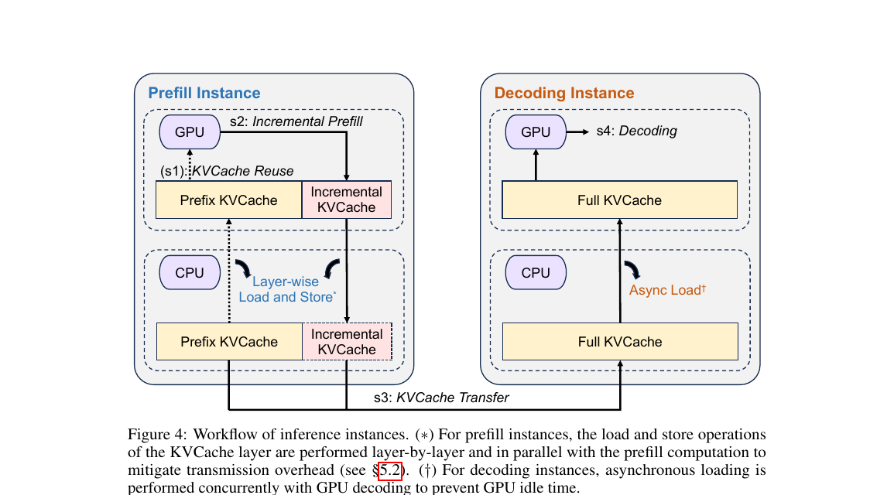

# Prefill/Decode 解耦与 Mooncake：LLM 推理的下一步

> 2026 年第一季度，vLLM、SGLang、TensorRT-LLM 三大主流推理引擎在两个月内相继集成了 **Mooncake Transfer Engine**，让 Prefill/Decode 解耦（P/D disaggregation）从学术论文走向了生产系统。本文梳理这背后的动机、传输机制，以及三家引擎的实现差异。

## 为什么 Prefill 和 Decode 要分家？

在之前的文章里我写过：LLM 推理的两个阶段有截然不同的瓶颈 —— [Prefill 是计算密集型，Decode 是内存密集型](./nvidia-vera-rubin-lpx.md)。一张 GPU 同时跑两个阶段，永远只能优化其中一个。

| 阶段 | 输入 | 瓶颈 | 最优硬件特征 |
|---|---|---|---|
| Prefill | 整个 prompt（几百 ~ 几千 token） | 矩阵算力（FLOPS） | 高算力、能满载 Tensor Core |
| Decode | 上一步的 1 个 token | 显存带宽（Bytes/s） | 高 HBM 带宽、低延迟 |

**Colocation（合并部署）的代价**：

1. Decode 阶段大量 Tensor Core 空转，等着数据从 HBM 搬进来
2. Prefill 阶段的大批量计算会阻塞正在 Decode 的请求，让 TBT（Time Between Tokens）抖动
3. 为了满足延迟 SLO，不得不把 batch size 压低，GPU 综合利用率常在 30% 以下

**解耦（Disaggregation）的思路**：

- **Prefill 节点池**：专门跑预填充。可以大 batch、高算力利用率；对 HBM 带宽不敏感，甚至可以用老一代 GPU
- **Decode 节点池**：专门跑逐 token 生成。需要最新的高带宽 HBM，但算力可以是次要考虑
- 两池之间传递的是 **KV Cache**（prompt 的 attention 中间结果）

::: info 一个直观的例子
如果你的服务平均 prompt 1K token、output 200 token，那 99% 的 token 位置实际上都在 Decode 阶段。把 Decode 单独放到带宽最优的节点，同时让 Prefill 节点用更老的 H100 集群承接新请求 —— 整机拥有成本（TCO）能降 30~50%。
:::

## 分家的代价：KV Cache 必须跨节点传输

解耦看起来很美，但有一个硬骨头：**Prefill 节点算出来的 KV Cache 必须完整地送到 Decode 节点**。

KV Cache 的尺寸不是小数目。以一个 70B 模型、prompt 长度 4096 tokens、FP16 为例：

$$
\text{KV Cache 大小} = 2 \times L \times H \times D \times T \times \text{bytes}
$$

其中 $L$ 是层数（80），$H$ 是 head 数（64），$D$ 是 head dim（128），$T$ 是 token 数（4096），bytes=2（FP16）：

$$
2 \times 80 \times 64 \times 128 \times 4096 \times 2 \approx 10.7 \text{ GB}
$$

也就是说，**一个请求的 KV Cache 可以达到 10GB 量级**。用传统 TCP 走 100Gbps 网络也要 0.8 秒才能传完 —— 这等于用户多等了一整个 Decode 的时间。

三个关键挑战：

1. **延迟**：从 Prefill 完成到 Decode 开始的等待时间，直接计入 TTFT（Time To First Token）
2. **带宽**：多请求并发时，总传输带宽可能撑爆网络
3. **零拷贝**：KV Cache 在 GPU 显存里，走 CPU 中转意味着 GPU→CPU→NIC→CPU→GPU 四次搬运

## Mooncake Transfer Engine：为 KV 传输而生

Mooncake 由 Moonshot AI（Kimi 背后的公司）与清华 KVCache.ai 项目组联合开源，核心理念是 **KV Cache-Centric Disaggregated Architecture** —— 整个推理系统围绕 KV 缓存的流动来设计。

### 核心组件

| 组件 | 作用 | 类比 |
|---|---|---|
| **Transfer Engine** | 零拷贝跨节点 KV 传输，支持 RDMA/EFA/Ascend | 操作系统的 DMA 控制器 |
| **Mooncake Store** | 分层 KV 缓存：GPU 显存 → 主机内存 → 远端存储 | 多级 Cache（L1/L2/L3） |
| **P2P Store** | 分布式 checkpoint 引擎，支持大模型快速同步 | Git 对于代码 |


### Transfer Engine 的三个关键设计

**1. RDMA 零拷贝——注意：跳过的是 CPU，不是网络**

这里有一个容易被误解的点：RDMA 并不是魔法般地绕过网络，**数据仍然要走物理链路从一张 NIC 到另一张 NIC**。它真正跳过的是两端主机上的 CPU 参与和主机内存拷贝。

传统 TCP 路径里，一次跨节点 GPU→GPU 传输要经历：

```
src GPU VRAM → src host RAM（PCIe 拷贝 + CPU 参与）
             → NIC 发送缓冲区（CPU 再拷一次）
             → 网络（物理链路，不可省）
             → dst NIC 接收缓冲区
             → dst host RAM（CPU 拷贝）
             → dst GPU VRAM（PCIe 拷贝）
总计：4 次内存拷贝 + 两端 CPU 中断处理
```

GPUDirect RDMA 路径里，两端 NIC 都通过 PCIe 直接 DMA **源端和目的端的 GPU VRAM**，CPU、内核态、主机 RAM 全部不参与：

```
src GPU VRAM  ──(NIC DMA)──→  网络  ──(NIC DMA)──→  dst GPU VRAM
总计：0 次主机内存拷贝，CPU 不参与数据路径
```

所以 "零拷贝" 指的是 **零主机内存拷贝 / 零 CPU 介入**。网络带宽仍然是硬上限：100/200/400 Gbps 的 InfiniBand 决定了传输下限。RDMA 的收益在于把延迟从 "毫秒级 + CPU 抖动" 降到 "微秒级 + 确定性延迟"，并把 CPU 完全释放给调度逻辑。



**2. 多后端支持**

为了适配不同的数据中心硬件，Transfer Engine 抽象出统一 API，支持：

- **RDMA (InfiniBand / RoCE)** —— 标准 NVIDIA 集群
- **EFA (Elastic Fabric Adapter)** —— AWS 自研网卡
- **Ascend** —— 华为昇腾 NPU 集群

**3. Block 级传输**

KV Cache 按照和 PagedAttention 一致的 **Block** 粒度传输（默认 16 tokens/block）。这样做有两个好处：

- Prefill 一边算完一个 block，就可以一边往 Decode 节点推送，**传输和计算流水线化**
- 在请求被打断/迁移时，Block 级粒度让恢复成本最低

## Mooncake Store：分层 KV 缓存

在单纯的 Transfer Engine 之上，Mooncake 还提供了一个分层缓存系统 **Mooncake Store**。核心思想是：**KV Cache 不一定每次都重新计算**。

很多场景下，prompt 是有复用模式的：

- 多轮对话的 system prompt 完全一致
- RAG 系统的 retrieved documents 经常重复出现
- Few-shot 示例在一批请求里共享

Mooncake Store 用三层存储承载 KV：

| 层级 | 存储介质 | 延迟 | 容量 |
|---|---|---|---|
| Device Tier | GPU HBM | ns ~ μs | 10s GB |
| Host Tier | 主机 DRAM | μs | 100s GB |
| Remote Tier | 分布式存储（SSD/NVMe over RDMA） | ms | TB ~ PB |

命中 Host 层意味着跳过 Prefill 直接 Decode；命中 Remote 层则需要先把 KV 加载回 GPU，但仍然比重算快得多。

## 三大引擎的集成现状

2025 年底到 2026 年初，三大引擎几乎同时完成 Mooncake 集成，但设计哲学有明显差异。

### vLLM：KV Connector 抽象

vLLM v1 引入了 **KV Connector** 插件接口，Mooncake 是其中一个实现。这种抽象让 vLLM 可以同时支持多种传输后端（Mooncake、NIXL、LMCache 等），Prefill/Decode 节点之间通过 Connector 注册-读取 KV Block。

**特点**：通用性强，适合多厂商硬件混搭；但抽象层带来少量延迟开销。

### SGLang：EPD 三段式解耦

SGLang 走得更极端，在 Prefill/Decode 之外单独拆出了 **Encode（多模态编码）**，形成三段式 **EPD Disaggregation（Encode-Prefill-Decode）**：

- **Encode 节点**：跑 vision encoder、audio encoder
- **Prefill 节点**：跑 LLM 的 prompt processing
- **Decode 节点**：跑 token-by-token 生成

这样做的动机：多模态模型里，图像/视频编码本身就是计算密集的独立阶段，把它拆出来可以让 LLM 节点一心做语言计算。SGLang 的 EPD 也使用 Mooncake Transfer Engine 作为跨阶段传输后端。

**实测数据**：SGLang 在 96 张 H100 上跑 DeepSeek 模型，**单节点达到 52,300 input tokens/sec、22,300 output tokens/sec**。

### TensorRT-LLM：KV Cache Connector API

NVIDIA 自家的 TensorRT-LLM 也引入了 **KV Cache Connector API**，并把 Mooncake 直接集成进来。与 vLLM 的 KV Connector 不同，TensorRT-LLM 的 API 更底层，把 KV Cache 的内存布局、量化格式、传输策略都暴露出来，给性能敏感场景更多调优空间。

### 对比小结

| 特性 | vLLM | SGLang | TensorRT-LLM |
|---|---|---|---|
| 抽象层次 | 中（KV Connector 插件） | 中（原生 disagg） | 低（底层 API） |
| 解耦粒度 | P/D 两段 | EPD 三段（含多模态） | P/D 两段 |
| Mooncake 集成 | v1 引入 | 2025-12 引入 | 2025-12 引入 |
| 生态覆盖 | 最广 | 多模态 + DeepSeek 最优 | NVIDIA 深度优化 |

## 生产数据：Kimi K2 on 128 H200

最能说明问题的是 Moonshot AI 自己的部署数据。他们用 **128 张 H200** 运行 Kimi K2 模型，启用 P/D 解耦 + Mooncake：

- **Prefill 吞吐**：224,000 tokens/sec
- **Decode 吞吐**：288,000 tokens/sec

这个数字意味着什么？按单用户 1K prompt + 200 output 算，理论上可以同时服务 **1000+ 并发用户的完整生成**。而在传统 colocation 架构下，相同 GPU 数量只能做到这个数字的 40-60%。


## 相关工作：不止 Mooncake

整个 2026 Q1，KV-centric 的创新在几个方向同时推进：

- **FlexKV**（Tencent + NVIDIA，2026-01）：分布式 KV 存储系统，支持跨集群 KV 复用，已和 Mooncake Transfer Engine 打通
- **SGLang HiCache**：Host 层 + Device 层的分层缓存，适用于 prefix 重复率高的场景
- **RadixAttention**（SGLang 核心）：基于 radix tree 的跨请求 prefix 匹配，命中率可达 50~85%
- **vLLM KVConnector 生态**：LMCache、NIXL 等多个第三方实现

## 我的看法

2024 年 vLLM 用 PagedAttention 把 **单节点内部** 的 KV Cache 管理从 20% 利用率推到了 96%。2026 年 Mooncake 做的事情，本质是把同样的思路扩展到 **跨节点**：让 KV Cache 成为一等公民，让 GPU 能专心做它最擅长的计算。

下一步的延伸方向很自然：

- **持久化 KV**：把 KV Cache 沉淀到对象存储，让同一 system prompt 在数月内都能复用
- **跨租户 KV**：在严格隐私边界内，让公共模型的共享 prefix 能跨用户复用
- **KV 压缩**：4-bit、2-bit 量化的 KV Cache 已经在研究中，能让传输和存储成本再降一个数量级

如果你对这个方向感兴趣，推荐顺序阅读：

1. [vLLM 与 PagedAttention](./vllm-pagedattention.md) —— 单节点 KV 管理的起点
2. [NVIDIA Vera Rubin + LPX](./nvidia-vera-rubin-lpx.md) —— 硬件视角的 P/D 分离
3. 本文 —— 软件视角的 P/D 解耦与跨节点传输

## 参考资料

- [Mooncake 官方文档](https://kvcache-ai.github.io/Mooncake/)
- [Mooncake: A KVCache-centric Disaggregated Architecture for LLM Serving](https://arxiv.org/abs/2407.00079)
- [The State of LLM Serving in 2026（Canteen）](https://thecanteenapp.com/analysis/2026/01/03/inference-serving-landscape.html)
- [SGLang vs vLLM 2026 Benchmarks（Particula）](https://particula.tech/blog/sglang-vs-vllm-inference-engine-comparison)
- [vLLM KV Connector 设计](https://github.com/vllm-project/vllm)
- [SGLang EPD Disaggregation](https://github.com/sgl-project/sglang)
