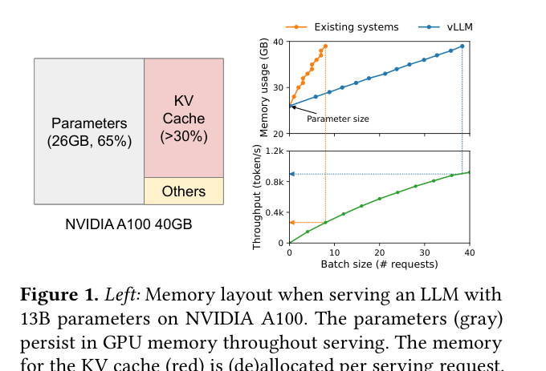
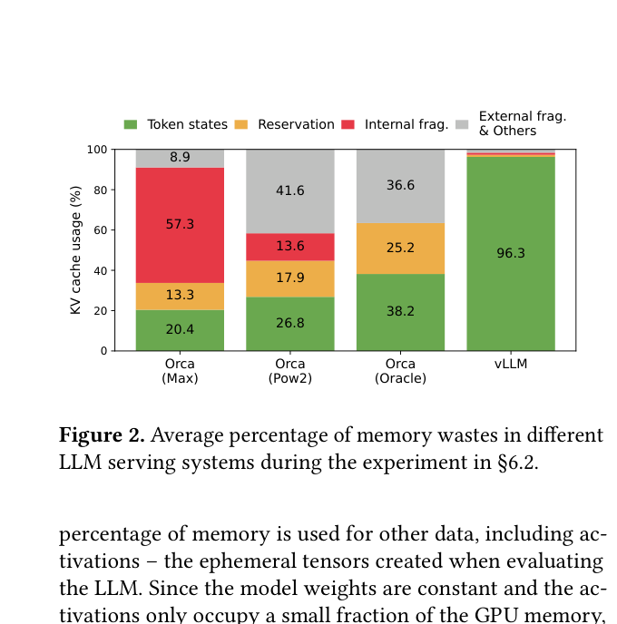
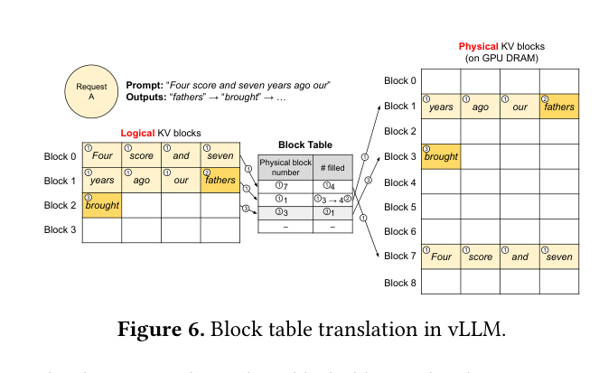
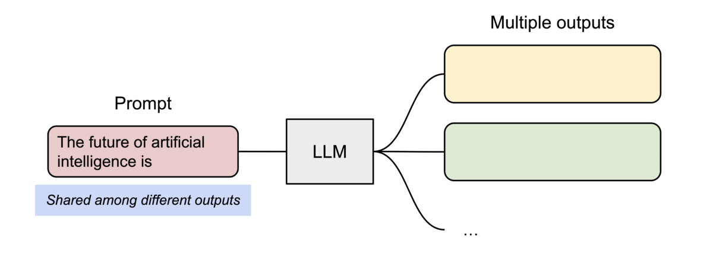

# vLLM 与 PagedAttention：LLM 推理的内存革命

> 本文基于论文 [Efficient Memory Management for Large Language Model Serving with PagedAttention](https://arxiv.org/abs/2309.06180)（SOSP '23, UC Berkeley）。vLLM 源码：[github.com/vllm-project/vllm](https://github.com/vllm-project/vllm)

写这个文章的目的是用来做论文的学习笔记，希望大家看完这个文章之后能够直观的理解Paged attention所用的各个技巧，然后就不用看论文了。
## 为什么需要 PagedAttention？

LLM 推理的核心瓶颈是 **内存**，而内存中最大的动态开销来自 **KV Cache**。

以一个 13B 参数的 OPT 模型为例，在 NVIDIA A100 40GB GPU 上：
- **模型参数**占 65%（26GB），在推理过程中保持不变
- **KV Cache** 占 >30%，随请求动态增长/缩小
- 剩余少量内存用于激活值（activation），仅在推理时临时使用



### 现有系统的内存浪费

现有的 LLM serving 系统（如 FasterTransformer、Orca）将每个请求的 KV cache 存储在 **连续的内存空间** 中，并按 **最大可能长度** 预分配。这导致三种浪费：

| 浪费类型                             | 说明                                                                    | 占比        |
| -------------------------------- | --------------------------------------------------------------------- | --------- |
| **预留浪费（Reserved）**               | 为一次 request 的未来 token 预留的空间，在请求存续期间无法被其他请求使用。**这些空间未来会被使用，但是现在不会被使用** | 最高可达整个分配块 |
| **内部碎片（Internal Fragmentation）** | 一个请求使用的 token 序列的实际长度远短于预分配的最大长度，剩余空间永远不会被使用                          | 显著        |
| **外部碎片（External Fragmentation）** | 不同大小的预分配块导致内存碎片，其他请求无法利用                                              | 显著        |


论文实测数据显示：在现有系统中，**实际有效的 KV cache 内存利用率可低至 20.4%**，而 vLLM 将利用率提升到了 **96.3%**。



## PagedAttention：分页 Attention 算法

### 核心思想：类比操作系统的虚拟内存

PagedAttention 的灵感来自操作系统的 **虚拟内存分页（paging）** 机制：

| 操作系统概念 | PagedAttention 对应 |
|---|---|
| 虚拟页（Virtual Page） | 逻辑 KV Block（Logical KV Block） |
| 物理页帧（Physical Page Frame） | 物理 KV Block（Physical KV Block） |
| 页表（Page Table） | Block Table |
| 进程（Process） | 序列（Sequence） |
| 页大小（Page Size） | Block Size（如 16 tokens） |

就像 OS 不要求进程的虚拟地址空间在物理内存中连续一样，PagedAttention 不要求一个序列的 KV cache 在 GPU 显存中连续存储。

### Block 的概念

PagedAttention 将每个序列的 KV cache 划分为固定大小的 **KV Block**。每个 block 存储固定数量 token（block size $B$，默认为 16）的 key 和 value 向量：

$$K_j = (k_{(j-1)B+1}, \ldots, k_{jB}), \quad V_j = (v_{(j-1)B+1}, \ldots, v_{jB})$$

### 分块计算 Attention

传统的 self-attention 计算公式为：

$$a_{ij} = \frac{\exp(q_i^\top k_j / \sqrt{d})}{\sum_{t=1}^{i} \exp(q_i^\top k_t / \sqrt{d})}, \quad o_i = \sum_{j=1}^{i} a_{ij} v_j$$

PagedAttention 将这个计算转化为 **按 block 分块** 的形式：

$$A_{ij} = \frac{\exp(q_i^\top K_j / \sqrt{d})}{\sum_{t=1}^{\lceil i/B \rceil} \exp(q_i^\top K_t \mathbf{1} / \sqrt{d})}, \quad o_i = \sum_{j=1}^{\lceil i/B \rceil} V_j A_{ij}^\top$$

其中 $A_{ij}$ 是第 $j$ 个 KV block 的 attention score 行向量。

核心变化：attention kernel 不再需要连续读取所有 K/V 向量，而是 **逐 block 读取**，每个 block 可以位于显存的任意位置。


<HtmlVisualization
  src="/machine-learning/inference/visualizations/paged-attention-computation.html"
  height="560px"
  title="PagedAttention 分块计算过程"
/>

### Decoding 过程动画

下面的动画展示了 PagedAttention 如何在 decoding 过程中动态管理 KV cache：


每次生成新 token 时，PagedAttention kernel 会识别并从不同的物理 block 中读取对应的 K/V 向量，计算 attention score，然后加权求和得到输出。这些 block 在物理内存中 **不需要连续**。

## KV Cache Manager：虚拟内存式的映射管理

### Block Table = 页表

vLLM 的 KV cache manager 维护一张 **Block Table**（类似 OS 的页表），记录每个序列的逻辑 block 到物理 block 的映射关系。

<HtmlVisualization
  src="/machine-learning/inference/visualizations/kv-cache-block-table.html"
  height="560px"
  title="KV Cache Block Table 映射"
/>

Block table 的每个条目记录：
- **逻辑 block 编号** → **物理 block 编号** 的映射
- 每个逻辑 block 的 **已填充位置数**

### 动态分配过程

以一个 prompt 为 "Four score and seven years ago our fathers brought" 的序列为例（block size = 4）：

**① Prefill 阶段**：prompt 有 9 个 token，vLLM 分配 3 个逻辑 block（block 0-2），映射到物理 block 7、1、3。Block 0 和 1 各存 4 个 token，block 2 存 1 个 token（剩余 3 个 slot 预留）。

**② 第一次 decode**：生成新 token "forth"。Block 2 还有空间，直接存入，更新填充数。

**③ 后续 decode**：当最后一个 block 填满后，vLLM 才分配新的物理 block，**按需增长**，不需要预留。




::: info 关键优势
与传统系统相比，vLLM 将内存浪费限制在 **每个序列最多一个 block 以内**（最后一个 block 的未填充空间），而非整个预分配空间的浪费。这就是 vLLM 能将内存利用率从 20% 提升到 96% 的核心原因。
:::

## 复杂解码场景的应用

### Parallel Sampling（并行采样）

**什么是 parallel sampling？** 给定同一个 input prompt，LLM 生成 **多个不同的候选输出**，用户从中选择最佳的一个。这在代码补全、创意写作等场景中非常常见。

**与 CoT（Chain of Thought）的关系**：CoT 推理的一种常见策略是 **self-consistency**——对同一个问题生成多条推理链（即 parallel sampling），然后通过多数投票选出最一致的答案。所以 parallel sampling 是实现 CoT 多路推理的基础设施。

**vLLM 的优势**：所有候选输出共享同一个 prompt，所以 prompt 部分的 KV cache **只需要存一份**。vLLM 通过让多个序列的逻辑 block 映射到 **相同的物理 block** 来实现共享，并引入 **引用计数（reference count）** 追踪每个物理 block 被多少个序列共享。



当某个候选序列需要写入新 token 到共享的最后一个 block 时，vLLM 使用 **Copy-on-Write（写时复制）** 机制：

1. 检测到该物理 block 的引用计数 > 1
2. 分配一个新的物理 block，拷贝原 block 的数据
3. 在新 block 上写入新 token
4. 原 block 的引用计数 -1
 一句话解释就是：**当你需要写入这个block的时候，再复制一个来写。不然这个重复的block就当做只读的block，只存一遍，和指针的概念类似**


::: tip 内存节省
论文实测：parallel sampling 可节省 **6.1% - 9.8%** 的 KV block 内存（Alpaca 数据集），prompt 越长节省越多。
:::

### Beam Search（束搜索）

**什么是 beam search？** Beam search 是一种在每一步保留 **top-k 最可能的候选序列** 的解码策略（k 称为 beam width）。它在机器翻译等需要高质量输出的任务中广泛使用。每一个token都有被选中的概率，那么概率相乘起来，在多个生成的序列candidate里面，把每个token的概率相乘取最大的几个，就是beam search。

**与 CoT 的关系**：如果说 parallel sampling 是在 **序列级别** 做"探索-选择"（生成多条完整推理链再选），beam search 则是在 **token 级别** 做"探索-剪枝"（每一步都保留最优的 k 条路径）。它们都是 LLM 推理中"多路探索"思想的不同粒度实现。

**vLLM 的优势**：beam search 的 candidates 之间共享更多 block（不仅是 prompt，还包括生成过程中重叠的部分），而且共享模式 **随 decoding 动态变化**（类似 OS 中 fork 创建的进程树）。

论文实测：beam search 的内存共享节省高达 **37.6% - 55.2%**（Alpaca 数据集），远高于 parallel sampling，因为 beam candidates 之间有更多的重叠部分。


## 调度与抢占策略

### Eviction 策略：All-or-Nothing

当 GPU 显存不足时，vLLM 需要将某些序列的 KV cache 换出（evict）。与 OS 中可以逐页换出不同，vLLM 采用 **All-or-Nothing** 策略：

- **属于同一序列的所有 block 一起换出**——因为序列的所有 token 在下次生成时都需要访问
- 多个序列组成 **sequence group**（例如 beam search 的所有 candidates），**整个 group 一起换出/调度**
- 这保证了组内序列之间的内存共享关系不被破坏

采用 **先来先服务（FCFS，First-Come, First-Served）** 的调度策略：优先保留最早到达的请求，最新的请求最先被抢占。

### Swapping（换出到 CPU 内存）

Swapping 是将被抢占序列的 KV cache block 从 GPU 显存 **搬运到 CPU 内存**。

<HtmlVisualization
  src="/machine-learning/inference/visualizations/swapping-timeline.html"
  height="600px"
  title="Swapping 时序图：GPU ↔ CPU 内存搬运"
/>

完整流程：

1. **触发**：新 token 生成时，GPU 物理块耗尽
2. **选择换出对象**：按 FCFS 逆序，选择一组序列（sequence group）
3. **Swap Out**：将该组所有 block 从 GPU 显存搬到 CPU 内存
4. **继续服务**：其他请求继续生成 token
5. **释放**：某请求完成后，释放其占用的物理块
6. **Swap In**：之前被换出的序列的 block 从 CPU 内存搬回 GPU 显存，继续生成

::: warning CPU 内存需求
一个关键的设计特性：**CPU 内存需求永远不会超过 GPU 为 KV cache 分配的显存**。

原因很简单：swap out 的数据全部来自 GPU 显存中的 KV cache 区域，被换出的 block 数量不可能超过 GPU 上总的物理 block 数量。所以 CPU 端需要的 swap 空间 **上界就是 GPU 上 KV cache 的大小**。

例如，如果 A100 40GB 为 KV cache 分配了 12GB 显存，那么 CPU 端最多需要 12GB 内存作为 swap 空间。
:::

### Recomputation（重计算）

另一种恢复被换出 KV cache 的方式是 **重新计算**（recomputation）：不保存被抢占序列的 KV cache，而是在需要时重新计算。

**为什么重计算比想象中快得多？**

这里有一个反直觉但极为重要的 insight：

::: tip 关键洞察：Recomputation 进入 Prefill 阶段
假设一个对话过程：
- 用户输入 prompt：**100 tokens**
- 模型通过 decode 逐个生成了：**5000 tokens**

**原始生成过程**：
- 100 tokens 的 **prefill**（并行矩阵乘法，很快）
- \+ 5000 步的 **decode**（每步只处理 1 个 token，自回归生成，很慢）

**重计算过程**：
- 将原始 prompt + 已生成的 5000 tokens = **5100 tokens 全部作为输入**
- 做一次 **5100 tokens 的 prefill**（并行矩阵乘法，一次完成！）

Prefill 阶段可以并行处理所有 token（大矩阵乘法），不需要自回归地逐个生成。所以 5100 tokens 的 prefill 速度 **远快于** 100 tokens prefill + 5000 步 decode。
:::

**为什么 block size 小时 recomputation 反而更快？**

这里需要理解 PCIe 传输的实际开销构成：

$$\text{swap cost} \approx N_{\text{transfers}} \times \text{latency}_{\text{fixed}} + \frac{\text{total bytes}}{\text{PCIe BW}}$$

每次 GPU↔CPU 传输都有一个**固定延迟（per-transfer latency）**，与传输的数据量无关。当 block size 小时（比如 4 tokens），每个 block 的数据量很小，但固定延迟不变——等于"开了很多次车但每次只运了一点货"，PCIe 带宽利用率极低。

相比之下，recomputation 的代价只取决于**序列长度**，与 KV cache 如何分块完全无关：

$$\text{recompute cost} \approx f(\text{sequence length}) \quad \text{（与 block size 无关）}$$

| block size | swap 效率 | recompute 效率 | 更优 |
|---|---|---|---|
| 4–16 | 低（大量小传输，固定延迟主导） | 不变 | Recompute |
| ~32–64 | 中（与 recompute 持平） | 不变 | 持平 |
| 128+ | 高（少量大传输，带宽充分利用） | 不变 | Swap |

论文实测（Fig. 19）：
- 当 block size 较小时（< 32），recomputation 比 swapping 更高效
- 当 block size 较大时（> 64），swapping 更高效
- 中等 block size（16-64），两者性能相当
- Recomputation 的开销 **与 block size 无关**（因为不涉及 KV block 的读写）

## 分布式执行

### Megatron-LM Style Tensor Model Parallelism

当模型太大无法放入单个 GPU 时，需要将模型 **切分** 到多个 GPU 上并行执行。vLLM 采用了 Megatron-LM 风格的 **tensor model parallelism**。

**什么是 Tensor Parallelism？** 将 Transformer 中的 **权重矩阵按维度切分** 到多个 GPU。具体到 attention 层，就是将 **不同的 attention head 分配到不同的 GPU**：

- 例如一个模型有 32 个 attention head，分布在 4 个 GPU 上
- GPU 0 处理 head 0-7，GPU 1 处理 head 8-15，GPU 2 处理 head 16-23，GPU 3 处理 head 24-31
- 每个 GPU 持有 1/4 的 attention 权重矩阵（$W_Q$, $W_K$, $W_V$, $W_O$ 的对应切片）

### SPMD（Single Program Multiple Data）

vLLM 采用 **SPMD 执行模型**：所有 GPU 运行 **完全相同的程序**，但处理 **不同的数据**（各自负责的 attention head 子集）。

执行流程：
1. **Scheduler 广播**：将相同的 input token IDs 和 block table 发送给所有 GPU worker
2. **Embedding lookup**：每张 GPU 各自用相同的 token IDs 做 embedding lookup（每张卡有完整的 embedding 表），得到相同的输入向量 X
3. **独立计算**：每个 GPU 用自己的权重分片（W_Q/W_K/W_V 的列切片）乘以完整输入 X，算出自己负责的 head 的 Q/K/V
4. **All-Reduce 同步**：在 attention 和 FFN 之后，通过 **NCCL** all-reduce 合并各卡的部分输出
5. **返回结果**：GPU worker 将采样的 token 发回 scheduler

::: info 什么是 NCCL？
**NCCL（NVIDIA Collective Communications Library）** 是 NVIDIA 提供的多 GPU 通信库，专为深度学习中的**集合通信操作**优化。

最常用的操作是 **All-Reduce**：每张卡贡献一个部分结果，NCCL 将所有卡的结果求和后发回每张卡。在 tensor parallelism 里，每层 attention/FFN 计算完后都需要一次 All-Reduce 把各卡的部分输出合并。

NCCL 会自动选择最优通信路径：
- **NVLink**（同机直连）：~600 GB/s，优先使用
- **PCIe**（同机但无 NVLink）：~32 GB/s
- **RDMA/InfiniBand**（跨机）：~200 GB/s

**注意**：input token 的传输不经过 NCCL，而是由 scheduler 直接发送 token IDs。NCCL 只负责各层计算完成后的中间结果合并。
:::

关键特性：**GPU worker 不需要同步内存管理信息**。它们只需要在每次 decoding iteration 开始时接收 scheduler 广播的 block table 即可。

### KV Cache 的分布式管理

<HtmlVisualization
  src="/machine-learning/inference/visualizations/tensor-parallelism-kv.html"
  height="600px"
  title="Tensor Parallelism 下的 KV Cache 分布式管理"
/>

在 tensor parallelism 下，KV cache 的分布遵循一个简单原则：

> **每个 attention head 的 KV cache 存储在处理该 head 的 GPU 上。**

- GPU 0 处理 head 0-7 → GPU 0 的显存存储 head 0-7 对应的 K/V cache
- GPU 1 处理 head 8-15 → GPU 1 的显存存储 head 8-15 对应的 K/V cache
- 以此类推

**统一的映射机制**：

虽然 KV cache 分散在不同 GPU 上，但 **block table 由 scheduler 统一管理**：

- 所有 GPU 共享 **相同的 block table**（逻辑 block → 物理 block 映射一致）
- 每个 GPU 上有自己的 **block engine**，负责实际的物理内存分配
- Input tokens 对所有 GPU 是 **共同的**（因为每个 GPU 都需要看到完整的输入来计算各自的 attention head）
- 这意味着逻辑 block 编号在所有 GPU 间是统一的，只是每个 GPU 的物理 block 中只存储了该 GPU 负责的 attention head 的 KV 数据

论文对此的描述：

> *The KV cache manager in each GPU worker independently manages the KV cache in its own GPU memory. However, the mapping between logical and physical KV blocks is consistent across GPU workers, as the scheduler sends the same block table to all workers.*

**Block table 的容量问题**：假设每张 GPU 有 100 个物理 block，4 张 GPU 共 400 个物理 block，那么 block table 有多少条目？

答案是 **100 条**，而不是 400 条。原因：分配 1 个逻辑 block 时，scheduler 会在 **所有 4 张卡上各占用 1 个物理 block**（每张卡存该 block 对应 token 的不同 head 的 KV）。逻辑 block 与物理 block 是"一对多 GPU"的关系：

```
logical block 0 → 物理 block 7（在所有 GPU 上同时分配）
  GPU 0: 物理 block 7 存 head 0-7  的 K/V，for token 1-16
  GPU 1: 物理 block 7 存 head 8-15 的 K/V，for token 1-16
  GPU 2: 物理 block 7 存 head 16-23 的 K/V，for token 1-16
  GPU 3: 物理 block 7 存 head 24-31 的 K/V，for token 1-16
```

| 维度 | 数量 |
|---|---|
| Block table 条目数（逻辑 block 上限） | **100** |
| 实际消耗的物理 block 总量 | **4 × 100 = 400** |
| 每分配 1 个逻辑 block，消耗物理 block | **4 个**（每张卡 1 个） |

::: warning 增加 GPU 数不扩展 token 容量
在 tensor parallelism 下，增加 GPU 数量扩展的是**模型容量和计算速度**，而不是 KV cache 的 token 容量。4 张 × 100 blocks 的可服务 token 量与 1 张 × 100 blocks 相同——只是每个 block 存了更多 head 维度的数据被分散到了多张卡上。
:::

::: info 为什么不需要跨 GPU 复制 KV cache？
因为每个 GPU 只需要自己负责的 attention head 的 KV cache。Head A 的 KV cache 只在处理 Head A 的 GPU 上计算和使用，**不需要传输到其他 GPU**。

GPU 之间的通信仅发生在 all-reduce 阶段（同步 attention 和 FFN 的输出），而不是 KV cache 层面。这大大减少了 GPU 间的通信量。
:::

## 总结

vLLM 的核心贡献是将操作系统中成熟的 **虚拟内存管理** 思想引入 LLM serving：

| 技术 | 效果 |
|---|---|
| **PagedAttention** | KV cache 不需要连续存储，近乎零浪费 |
| **Block Table 映射** | 动态分配，按需增长，消除预留浪费 |
| **Copy-on-Write** | Parallel sampling 和 beam search 高效共享 KV cache |
| **All-or-Nothing Eviction** | 整组序列统一调度，保持共享关系 |
| **Swapping + Recomputation** | 两种互补的 KV cache 恢复策略 |
| **分布式 KV Cache 管理** | 统一 block table，支持 tensor parallelism |

实测效果：vLLM 在不影响模型精度的前提下，将 LLM serving 吞吐量提升 **2-4 倍**，在复杂解码场景下提升更为显著。
